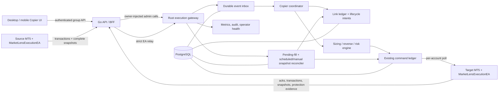
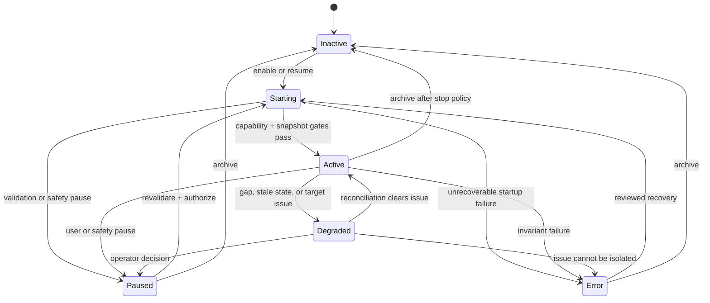
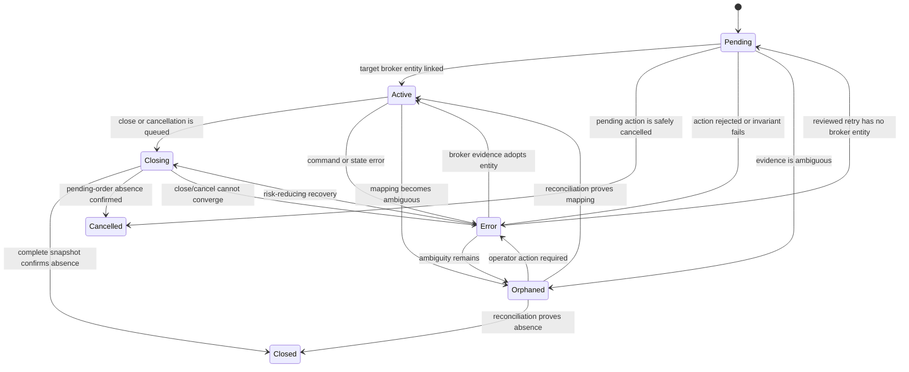

# MT5 Trade Copier: End-to-End Production Plan

- Status: implemented full-flow foundation plus production-hardening plan
- Repository baseline reviewed: 6 August 2026
- Reference behavior reviewed: [DAOEA MT5 Trade Copier v1.5.1](https://daoea.co/ea/copier)

This document uses the external product only as a capability reference. It does
not reproduce its code, internal design, interface, wording, or proprietary
artifacts.

## Implementation checklist

The checked items are foundations already present in the current repository;
they do not mean that the continuous copier is complete.

- [x] Broker-neutral Go BFF, Rust execution gateway, PostgreSQL command ledger,
  MT5 EA sessions, per-target routing, deferred delivery, and unknown outcomes.
- [x] Interim one-shot web-order fan-out and manual one-time trade copy.
- [x] Additive migration `0035_execution_continuous_copier` and Rust domain
  contracts for revisioned groups, targets, inbox/work/outbox, links,
  reconciliation, errors, and broker margin policy.
- [x] EA v1.25 enriched transaction telemetry, atomic event-plus-portfolio
  upload, journal-before-submit idempotency, and broker margin preflight.
- [x] Rust admin persistence for copy-group list/upsert and
  pause/resume/reconcile/archive actions with optimistic revision and audit.
- [x] Go BFF `/execution/copy-groups` routes and TypeScript resource/client
  scaffolding for the same owner-scoped contracts.
- [x] `frontend/src/components/trade/ContinuousCopierPanel.tsx` and the
  `CopyRoutingPanel` mode switch provide a continuous-group management scaffold
  while retaining a separately labelled one-shot web-order path.
- [x] Snapshot-driven runtime coordinator: transactional lifecycle inbox,
  per-target leased work, command outbox publication, link creation/adoption,
  acknowledgement updates, bounded retry, and structured error history.
- [x] Initial continuous market and pending lifecycle orchestration, including
  create, modify, partial/full close, cancel, replace, and pending-fill
  reconciliation work.
- [x] Lifecycle race hardening for explicit order-to-position fill evidence,
  market-ack position-ticket binding, deterministic per-increase target legs,
  idempotent retry quantities, and lifecycle-before-reconciliation draining.
- [x] Pre-enqueue terminal supersession for obsolete open/pending work,
  per-group/target command serialization through acknowledgement, and a
  pending-fill path that adopts linked orders while allowing only an eligible,
  unlinked market fallback.
- [x] Target policy propagation through routing for allocation, reverse,
  symbol mapping, maximum quantity, and the saved broker margin cap.
- [x] Single-authority allocation, correct limit/stop entry fields, reverse
  SL/TP transformation, initial protection opt-out, and stale risk-increase
  supersession while close/cancel/reconcile work remains executable.
- [x] Target-snapshot protection work for maximum drawdown, trailing stop, and
  breakeven, using deterministic generated inbox/work identities.
- [x] Scheduled and manual complete-snapshot reconciliation with leased runs,
  per-link discrepancy items, safe close/cancel repair, and runtime health
  updates.
- [x] Safe control defaults: new groups and targets start disabled, continuous
  targets default to a 35% balance margin cap, and activation/resume requires
  trade authorization.
- [x] Destructive configuration guards: owner-serialized activation prevents
  graph write-skew, resume repeats account/target/cycle validation, and source
  changes, target removal/disable, account removal, or archive cannot strand
  non-terminal links. New enabled targets cannot join a group with a live
  baseline that has not been explicitly reconciled.
- [ ] Durable ordered stream generation/watermark, gap handling, copied-origin
  filtering, source eligibility, and negotiated capability gates.
- [ ] Complete hedging-leg/netting-contribution semantics, startup/gap
  reconciliation, high-availability proving, and EA-local protection evidence.
- [ ] Race/chaos acceptance coverage and the remaining operator detail APIs.
- [x] Responsive desktop/mobile continuous-group editor with guarded refresh,
  revision-aware save/actions, runtime counters, and one-shot separation.
- [ ] Reconciliation/error detail UI, complete automated test matrix, Demo and
  Live canaries, rollback drill, and production sign-off.

## 1. Product decision and completion boundary

The implementation objective is a **continuous MT5 lifecycle copier**:

1. A user creates a group with one source account and one or more target
   accounts.
2. The backend observes eligible trades created or changed in the source MT5
   terminal, regardless of whether the action originated in this web app.
3. Every target is planned, sized, protected, executed, and audited
   independently.
4. Later source changes are mirrored according to the saved policy: open,
   pending create/update/cancel/fill, stop-loss or take-profit modification,
   quantity increase, partial close, and full close.
5. Durable links and periodic reconciliation recover from disconnects, process
   crashes, duplicated events, lost acknowledgements, and broker-side changes.

The current one-shot routing feature is useful but is only an interim
capability:

- `buildExecutionOrderRequest` can fan a new web order out to configured
  targets.
- `CopyTradeDialog` can create a one-time copy of an existing position or
  pending order.
- The current request does not establish a durable source-to-target link.
- A later close, cancel, fill, SL/TP update, or partial close is not
  automatically related to that one-time copy.
- Trades created directly in the source terminal are not continuously copied.

The product must not use labels such as "Live Copier", "continuous",
"synchronized", or "fully mirrored" for the interim path. Full lifecycle
claims are allowed only after every production gate in this plan passes.

## 2. Terminology

| Term | Meaning |
| --- | --- |
| Source account | MT5 account whose eligible trade lifecycle is observed. |
| Target account | MT5 account that receives independently planned lifecycle actions. |
| Copier group | Versioned configuration connecting one source to one or more targets. |
| Source resource | A source pending order, hedged position, netting exposure slice, or deal lineage. |
| Link | Durable mapping between one source resource and one target resource or exposure contribution. |
| Source event | Ordered, deduplicated observation that can change desired target state. |
| Lifecycle intent | Immutable backend decision derived from a source event and a group revision. |
| Target action | One independently executable place, modify, close, cancel, or protection action. |
| One-shot routing | A single web request fanned out to several accounts without later lifecycle tracking. |
| Continuous copying | Event-driven lifecycle orchestration backed by durable links and reconciliation. |
| Risk-increasing action | Open, pending create, top-up, stop loosening, or any action that can increase exposure. |
| Risk-reducing action | Cancel, partial/full close, or a stop update that cannot increase loss. |

## 3. Capability reference: DAOEA v1.5.1

The following table is a behavior map, not an implementation prescription.

| Reference capability | Required behavior in this repository |
| --- | --- |
| Source/channel to multiple followers | A durable copier group has one source and independently controlled targets. |
| Market open and full close | Opening and final closure are linked and idempotent per target. |
| Partial close | Target quantity is reduced from the linked contribution, not from an unrelated broker position. |
| Pending create, modify, and delete | Pending orders have their own durable link and lifecycle actions. |
| Pending fill transition | A filled pending link becomes an open-position link without creating a second market order. |
| SL/TP synchronization | Protective-price changes are normalized to target tick and stop rules before execution. |
| Fixed lot | Each target may use a configured absolute lot quantity. |
| Equal quantity | Target quantity follows the source quantity one-for-one before normalization. |
| Multiplied quantity | Target quantity equals source quantity times a configured multiplier. |
| Equity-proportional quantity | Target quantity scales by target equity divided by source equity, with an optional multiplier. |
| Symbol mapping | Canonical symbols resolve through each target's existing instrument and mapping records. |
| Reverse direction | Side and protective geometry are transformed explicitly; invalid pending geometry is rejected. |
| Maximum lot | A per-target ceiling is applied with a visible warning before broker submission. |
| Source filters | Symbol, magic-number, comment/prefix, and origin filters decide whether a source resource is eligible. |
| Equity protection | Risk-increasing actions stop when configured target equity rules fail; closing actions remain available. |
| Independent trailing and breakeven | Target protection continues from target state and does not depend on further source activity. |
| Isolated groups/channels | Group identity, revision, health, actions, and audit records never leak across owners or groups. |

### 3.1 Reference changes that must become regression tests

The v1.5.0 release notes describe a pending-fill race in which a pending order
could fill while a copier was deciding to send a market replacement. The
reported correction performs a final state check immediately before market
submission and adopts the already-filled resource instead of opening another
trade. This behavior is a mandatory invariant in Sections 10 and 16.

The same release describes a broker-side margin guard with a default ceiling of
35% of account balance per trade. It applies to market opens, pending creates,
and exposure increases. A violation rejects the action with useful diagnostics;
it does not silently reduce the lot size.

The v1.5.1 release notes describe trailing-stop and breakeven processing being
omitted from the follower processing loop. The correction makes both policies
run from target state rather than source activity, and breakeven remains active
when trailing is disabled. The target EA tests must prove both properties.

## 4. Current repository baseline and gaps

### 4.1 Foundations available now

| Area | Current implementation |
| --- | --- |
| Security boundary | The authenticated Go BFF injects the owner identity. Rust admin port `8791` and EA port `8790` stay on loopback; Go exposes only the EA route allow-list. |
| Account registry | `execution_accounts`, EA pairing/sessions, liveness, capabilities, account state, instruments, and symbol mappings exist. |
| EA transport | `MarketLensExecutionEA.mq5` v1.25 sends account/instrument/position/pending snapshots and enriched transaction events over HTTPS polling. A buffered trade event is uploaded only with the complete portfolio snapshot it caused. |
| EA submit safety | The EA persists the ambiguous `submitting` boundary before `OrderSend`, replays recorded outcomes, and now applies optional `brokerMarginCap` with `OrderCalcMargin` before risk-increasing place commands. |
| Lifecycle commands | The domain and EA protocol support place, modify position, modify pending, partial/full close, cancel, and sync commands. |
| Durable execution | `execution_commands`, `execution_target_commands`, and `execution_events` record owner- and target-scoped work and outcomes. |
| Delivery safety | Per-target idempotency, deferred five-minute delivery, leases, broker identifiers, and `unknown` outcomes already exist. Unknown delivery is not blindly retried. |
| Deterministic routing | `execution-engine` validates account readiness, symbol policy, protective prices, quantities, quantity steps, limits, and risk-percent sizing per target. |
| Risk controls | Account risk policies and the versioned Prop Risk Guard can block or cap new risk and can trigger protective actions. |
| Continuous schema | Migration `0035_execution_continuous_copier` adds group/target revisions and runtime status plus lifecycle inbox, leased work, command outbox, link, reconciliation, and error tables with owner-scoped foreign keys and idempotency constraints. |
| Continuous domain | Rust models continuous group/target configuration, all allocation modes, reverse flag, symbol mapping, protection settings, margin basis/cap, runtime status, and strict decimal wire behavior. |
| Rust group API | Loopback admin routes `/v1/admin/copy-groups` and `/v1/admin/copy-groups/actions` persist and audit group configuration and pause/resume/reconcile/archive actions with optimistic revisions. |
| Portfolio characterization | `backend/execution/crates/execution-gateway/src/copier.rs` deterministically classifies position open/increase/reduce/close/protection changes and pending create/modify/replace/cancel/fill from complete snapshots. |
| Browser control surface | Go BFF routes `/execution/copy-groups` and TypeScript `executionApi.ts`/`continuousCopier.ts` now mirror the group upsert/action contract, with strict bounds and revision fields. |
| Continuous UI scaffold | `frontend/src/components/trade/ContinuousCopierPanel.tsx` loads owner-scoped groups, refreshes server state every 10 seconds, shows runtime/link/work/error counters, and edits revisioned group/target policy. The editor already exposes lifecycle toggles, filters/timing, allocation, reverse, mapping, margin/equity protection, trailing, breakeven, and pause/resume/reconcile/archive controls. |
| Safe activation baseline | New continuous group and target drafts are disabled. Rust and TypeScript default a continuous target to a 35% balance broker margin cap, and enabled saves/resume actions run through the existing exact-payload trade-authorization flow in TypeScript, Go, and Rust. Owner-scoped advisory locking serializes group activation, resume repeats account/target/cycle checks, and non-terminal links block destructive source/target/archive/account-removal transitions. A newly enabled target cannot silently join an existing live baseline. Account removal soft-disables affected copier configuration and preserves lifecycle/audit history after the group is drained. |
| Continuous runtime | Complete source snapshots are diffed under a source advisory lock, changes are inserted into the owner/group-scoped inbox, target work is leased with `SKIP LOCKED`, commands are persisted through the copier outbox and existing target-command ledger, and EA outcomes update outbox/link state in the same event transaction. Explicit MT5 transaction evidence correlates pending fills and market acknowledgements to position tickets. Later close/cancel/fill observations supersede predecessor risk work only when no target command was durably issued; provisional links and outbox rows are closed with that transition. Linked pending fills adopt/reconcile, while an unlinked market fallback remains subject to source filters and is suppressed during pause. Lifecycle work drains before complete-snapshot reconciliation, which records per-link discrepancies and stages safe close/cancel repairs. |
| Target policy/protection runtime | Continuous place work reuses execution-engine routing as the single allocation authority, Prop Risk Guard, symbol mappings, reverse policy, and forwards the saved `brokerMarginCap` to EA v1.25. Limit/stop fields and reverse protection geometry remain correct across create/modify, `copyStopLossTakeProfit` applies to the initial copy, and expired open/pending work is superseded by `staleAfterMs`. Complete target snapshots also generate idempotent maximum-drawdown close/cancel and monotonic trailing/breakeven modification work. |
| One-shot UI | Desktop Trade includes an MT5 Copier tab; mobile keeps the five primary destinations and exposes Copier inside Trade. |
| One-shot preferences | The current working tree stores per-source target drafts in `settings.ui.tradeCopier` through `copierPreferences.ts`. It supports equal, fixed, multiplier, equity-proportional, risk-percent, maximum quantity, and symbol mapping inputs. |
| One-time existing-trade copy | Position and pending-order cards can open `CopyTradeDialog` and route one new target order. |

### 4.2 Important limitations

| Gap | Consequence |
| --- | --- |
| Ordered stream is incomplete | EA v1.25 provides a time-seeded `transactionSequence` and rich transaction fields, but it has no durable stream generation, persisted contiguous watermark, replay contract, or mandatory stable external event ID. A restart must not be mistaken for a continuous sequence. |
| Runtime is snapshot-driven, not yet stream-complete | The worker path is live in the working tree, but it derives transitions from consecutive complete snapshots. Without a durable stream generation, contiguous watermark, replay contract, and payload-conflict record, it cannot yet prove that every broker transition was observed across restart or a gap. |
| Link runtime is an initial implementation | Place/outcome correlation, revisions, per-leg close/modify work, partial-close ratio scaling, target-serialized command ordering, unissued-work supersession, pending replacement ordering, linked-fill adoption, eligible unlinked-fill fallback, and scheduled/manual snapshot reconciliation are wired. Full broker-characterized hedging top-up attribution, netting contribution aggregation, terminal-side fill preconditions, and ambiguous/manual exposure quarantine remain production gates. |
| Browser readiness is incomplete | Owner-scoped Go/TypeScript routes and activation/resume trade authorization are implemented. User-reviewed baseline capture, negotiated capability/readiness checks, preview, paginated detail, and the continuous health contract are still required before general Live activation. |
| Runtime status is provisional | Processing a source diff can move an enabled group to `active`, but that status does not yet prove a contiguous source watermark, negotiated EA capabilities, or a passing startup reconciliation. |
| Settings are not authority | `settings.ui.tradeCopier` is a user-interface preference document. It has no database foreign keys, optimistic group revision, activation state, lifecycle policy, or worker ownership. |
| One-shot lifecycle break | Web fan-out and `CopyTradeDialog` do not mirror later modify/close/cancel/fill operations. |
| Event correlation still needs hardening | Enriched transactions and atomic complete snapshots improve evidence, but pending-fill classification remains heuristic until generation/watermark, origin, and broker-history correlation are durable. |
| Hedging/netting attribution is incomplete | The link schema and first target leg are present, but a broker position ID alone is insufficient for multi-leg hedging and for netting accounts where several source links contribute to one symbol-level target position. |
| Loop prevention is partial | Enabled group saves reject any account that would become both an enabled source and target, so chained copier graphs are blocked. A durable copied-origin marker is still required for future chained-copy support and richer eligibility policy. |
| Protection runtime needs final hardening | Saved margin policy is routed to the EA, and target complete snapshots drive maximum-drawdown reduction plus independent monotonic trailing/breakeven work. The remaining gap is EA-local persistence/evaluation during backend disconnect, explicit protection evidence, broker freeze/throttle characterization, and multi-terminal acceptance coverage. |
| Continuous health UI is partial | The new panel shows group/target runtime badges, active-link, queued-work, and unresolved-error counts, but it does not yet expose source watermarks, link drift, reconciliation items, unknown actions, paused-risk reasons, or protection evidence. |
| Activation baseline is safe but not a readiness gate | Browser/domain defaults now start disabled and serialize the DAOEA-compatible 35% balance cap; enabled saves and resume require trade authorization. Activation still needs fresh source/target baseline review, negotiated capabilities, mapping checks, and startup reconciliation before `active` is production-authoritative. |
| Test gap | `frontend/tests/trade/continuousCopier.test.ts` and `copierPreferences.test.ts` cover DTO/default/validation and legacy preference normalization, but no browser spec or multi-terminal continuous lifecycle harness exists. |

### 4.3 Design decision

Keep the existing platform architecture. Do not imitate a local shared-file or
terminal-to-terminal transport:

- Go remains the authenticated browser BFF and public EA relay.
- Rust remains the broker-neutral execution and copier authority.
- PostgreSQL remains the durable source of truth.
- Each target continues to poll only for its own commands.
- The EA performs broker-local margin calculation. Current stop protection is
  target-snapshot driven in Rust; broker-local tick-sensitive protection is the
  final resilience target.
- Existing command, event, audit, account, instrument, symbol-mapping, and Prop
  Risk Guard facilities are extended rather than bypassed.

## 5. Safety and correctness invariants

1. Every row, API request, lease, event, group, link, and command is scoped by
   `user_id`.
2. Source and target must belong to the same owner, must be distinct, and must
   be MT5 accounts with a compatible copier capability.
3. Group edges must be acyclic. Chained copying is disabled for the first
   production release.
4. One target failure never hides or rolls back successful outcomes on another
   target.
5. Decimal strings cross JSON boundaries; JavaScript floating-point values are
   never authoritative for money, price, or quantity.
6. A source event can produce at most one semantic action of each kind for a
   target and link revision.
7. Reusing an idempotency key with a different payload is a conflict and
   quarantines the action.
8. `unknown` means the command may have executed. It is reconciled before any
   risk-increasing retry.
9. Complete, fresh broker state is required before repair actions. Absence from
   a partial or stale snapshot is not evidence of closure.
10. Risk-reducing close/cancel actions remain available when new opens are
    paused, an equity floor is breached, or a target is being drained.
11. A margin-cap rejection never silently changes quantity.
12. Stops are never loosened by trailing or breakeven logic.
13. Enabling a group never back-copies pre-existing source trades unless the
    user explicitly requests a reviewed bootstrap import.
14. Disabling or deleting configuration does not delete link, command, event,
    reconciliation, or audit history.
15. Copied resources are tagged and recorded so they cannot re-enter the source
    filter as new external trades.

## 6. Target architecture and ownership



### 6.1 Component responsibilities

**Source/target EA**

- Emits transaction observations and atomic complete portfolio snapshots. A
  persisted ordered generation/watermark contract remains a rollout gate.
- Advertises copier protocol and broker capabilities.
- Executes a command idempotently and returns broker identifiers and structured
  rejection data.
- Calls broker-native margin calculation immediately before risk-increasing
  submission.
- Applies backend-planned close/cancel/stop modifications and reports resulting
  broker state. Final EA-local protection persistence/evaluation and dedicated
  protection evidence remain hardening work.

**Go BFF**

- Authenticates browser users and injects immutable owner identity.
- Applies existing session, mutation, trading, pairing, and request-rate limits.
- Requires trade authorization for group activation, risk-increasing active
  configuration changes, bootstrap import, flatten, and repair commands.
- Proxies only the explicit EA route allow-list and never exposes Rust admin
  credentials.

**Rust execution gateway**

- Validates and stores group revisions.
- Diffs complete source snapshots, deduplicates semantic payloads into the
  lifecycle inbox, leases per-target work, and publishes the transactional
  command outbox. Durable source ordering/gap recovery is the next contract.
- Runs lifecycle toggles, state transitions, sizing, reverse transforms,
  symbol policy, saved margin policy, and command planning.
- Owns initial link/outcome state, action idempotency, leases, pending-fill
  adoption, target-snapshot protection, reconciliation records, and audit.
- Reuses the existing venue adapter and command ledger for delivery.

**PostgreSQL**

- Is the only authoritative configuration, lifecycle, command, and audit store.
- Provides unique constraints and row locks that enforce idempotency across
  multiple Rust instances.
- Retains immutable inputs and decisions needed to explain every target action.

## 7. Versioned contracts

### 7.1 EA capability gate

The current transport uses `protocolVersion: 1`, and the current EA is v1.25.
That EA has enriched transaction telemetry and broker margin preflight, but it
does not yet advertise a negotiated continuous-copier capability set.
Continuous copying requires a separately advertised capability, for example:

```json
{
  "continuousCopierSource": 1,
  "continuousCopierTarget": 1,
  "orderedTradeEvents": 1,
  "brokerMarginPreflight": 1,
  "targetProtection": 1
}
```

Additive fields may remain on transport protocol v1 while old EAs are
supported for one-shot operation. If a wire change is not backward compatible,
raise the transport protocol and support the old protocol during rollout. A
group cannot enter `active` until its source and all enabled targets advertise
the required capability set. Do not infer capability from an EA version string
alone.

### 7.2 Ordered event batch

A copier-capable event batch must add these required fields:

```json
{
  "eventSchemaVersion": 1,
  "agentInstanceId": "random-per-EA-installation-instance",
  "streamGeneration": "uuid-created-after-state-loss-or-reseed",
  "firstSequence": 1250,
  "lastSequence": 1254,
  "batchId": "stable-id-for-this-payload",
  "portfolioSnapshotComplete": true,
  "snapshotObservedAtMs": 1785620000000,
  "events": []
}
```

Contract rules:

- Sequence numbers increase by one inside a stream generation.
- The same `(account, generation, sequence)` always has the same canonical
  payload hash.
- A generation changes only after explicit reseed/state loss; it never hides a
  gap.
- `portfolioSnapshotComplete` applies to a declared snapshot boundary and
  includes both positions and pending orders.
- Server receipt time and broker occurrence time are stored separately.
- A duplicate batch returns success with the existing watermark.
- A gap stores later events but pauses planning until replay or a complete
  reseed snapshot closes the gap.

EA v1.25 already supplies `transactionSequence` and sends buffered trade events
with the complete portfolio snapshot from the same timer cycle. The fields
above are the remaining durable ordering contract: the current time-seeded
sequence is not a persisted generation/watermark and therefore is insufficient
by itself for restart-safe lifecycle planning.

### 7.3 Source event

The Rust domain and EA v1.25 now carry an enriched `TradeTransaction` with
transaction sequence/time/type, order/deal/position identifiers, side, symbol,
order/deal details, quantity, price, SL/TP, magic/comment where available, and
backward-compatible aliases. The target contract must additionally make event
identity, origin, generation, and semantic before/after state durable:

```json
{
  "eventId": "stable-agent-event-id",
  "sequence": 1252,
  "type": "pendingFilled",
  "origin": {
    "kind": "external",
    "copierGroupId": null,
    "copierLinkId": null
  },
  "resource": {
    "brokerOrderId": "7812",
    "brokerDealId": "9914",
    "brokerPositionId": "4421",
    "canonicalSymbol": "EURUSD",
    "venueSymbol": "EURUSD.a",
    "side": "buy",
    "kind": "limit",
    "magic": 1234,
    "comment": "strategy-a"
  },
  "before": {},
  "after": {},
  "occurredAtMs": 1785620000000
}
```

The exact event vocabulary is:

- `pendingCreated`
- `pendingChanged`
- `pendingCancelled`
- `pendingFilled`
- `positionOpened`
- `positionIncreased`
- `positionChanged`
- `positionReduced`
- `positionClosed`

Deals and broker transactions remain stored as evidence. The coordinator may
derive a semantic event from two complete snapshots only when the generation
and watermarks prove that no required transition is missing.

### 7.4 Group contract

A group response contains:

- identity: `id`, `ownerId` internally, `name`, `sourceAccountId`;
- state: `status`, `revision`, `enabledAtMs`, `pausedAtMs`, `statusReason`;
- filters: symbol allow/deny, magic include/exclude, comment prefix/regex with
  bounded syntax, and copied-origin exclusion;
- lifecycle policy: opens, top-ups, pending, modify SL/TP, partial close, full
  close, bootstrap mode, repair policy, and stop behavior;
- ordered targets with allocation, reverse, limits, equity rules, margin rules,
  trailing, breakeven, and symbol-mapping readiness;
- health: source watermark, last complete snapshot, target readiness, open
  links, drift, unknown actions, and last reconciliation;
- immutable `createdAtMs` and mutable `updatedAtMs`.

Every mutation supplies `expectedRevision`. A mismatch returns `409` with the
current revision; the server never performs last-write-wins on active copier
configuration.

The current upsert contract is deliberately explicit and decimal-safe:

```json
{
  "groupId": "optional-existing-uuid",
  "group": {
    "expectedRevision": 4,
    "name": "London followers",
    "sourceAccountId": "mt5_source_01",
    "enabled": false,
    "config": {
      "copyMarketOrders": true,
      "copyPendingOrders": true,
      "copyStopLossTakeProfit": true,
      "copyModifications": true,
      "copyPartialCloses": true,
      "maxSlippagePoints": 30,
      "staleAfterMs": 30000,
      "reconciliationIntervalMs": 5000
    }
  },
  "targets": [
    {
      "expectedRevision": 2,
      "accountId": "mt5_target_01",
      "enabled": true,
      "config": {
        "allocation": {
          "mode": "equityProportional",
          "multiplier": "1"
        },
        "reverseTrade": false,
        "symbolMapping": {
          "EURUSD": "EURUSD.a"
        },
        "protection": {
          "brokerMarginCap": {
            "basis": "balance",
            "basisPoints": 3500,
            "alert": true
          },
          "trailingStopPoints": 0,
          "trailingStepPoints": 5,
          "trailingStartPoints": 0,
          "breakevenTriggerPoints": 0,
          "breakevenOffsetPoints": 1
        }
      }
    }
  ]
}
```

The browser must submit decimal quantities and multipliers as strings. The
server may return defaults, runtime status, pending work, unresolved errors,
and active-link counts in the group view.

### 7.5 Lifecycle intent and target action

Each lifecycle intent stores:

- owner, group ID and exact group revision;
- source account, generation, event ID, sequence, resource kind and resource ID;
- semantic action and canonical before/after desired state;
- deterministic input hash and decision timestamp.

Each target action stores:

- intent ID, link ID, target account, action kind and link version;
- normalized desired payload;
- deterministic idempotency key;
- referenced `execution_target_commands` row;
- status, rejection/unknown details, and reconciliation disposition.

A recommended idempotency-key form is:

```text
copier:{groupId}:{linkId}:{linkVersion}:{action}:{targetAccountId}
```

IDs may be hashed to fit existing length constraints, but the unhashed
components remain in audit details.

## 8. Database plan

Migration `0035_execution_continuous_copier` was applied in production on
6 August 2026. It is additive to `0026_execution_platform` and has a matching
development down migration. Before its first successful application, explicit
cross-column checks were renamed so they cannot collide with PostgreSQL's
automatically generated per-column check names. Applied migrations must never
be edited; production rollback uses feature/state rollback rather than
destructive migration rollback.

### 8.1 Implemented schema foundation

`0035` extends `execution_copy_groups` with:

- a safe-disabled database default for new groups;
- `revision` and `applied_revision`;
- `runtime_status`: `inactive`, `starting`, `active`, `paused`, `degraded`,
  or `error`;
- versioned `configuration` JSON;
- status message, last event, and last reconciliation timestamps;
- owner/runtime indexes and revision constraints.

It extends `execution_copy_targets` with:

- a safe-disabled database default for new targets;
- `fixed_quantity` and all five allocation modes;
- allocation unit, target/applied revisions, and runtime status;
- versioned target `configuration` and `symbol_mapping`;
- status/error/reconciliation timestamps;
- owner/group/account uniqueness and exact mode-specific fixed-quantity
  validation.

The Rust domain supplies strict, validated configuration types for lifecycle
toggles, source magic/comment filters, stale and reconciliation intervals,
allocation, reverse, per-target symbol maps, maximum quantity, maximum
drawdown, margin cap, trailing, and breakeven. Configuration JSON is the
extensible policy envelope; relational columns retain queryable allocation and
runtime invariants.

### 8.2 Implemented lifecycle tables

| Table | Current purpose and constraints |
| --- | --- |
| `execution_copy_lifecycle_inbox` | Owner/group/source event inbox with optional sequence, unique source event ID, source kind/ID pairing, retry/dead-letter states, and leases. |
| `execution_copy_work_items` | Per-target semantic operations with expected link revision, group-consistent inbox reference, idempotency, retry/dead-letter states, and leases. |
| `execution_copy_command_outbox` | Transactional publication boundary joined to the existing target-command ledger, with group-consistent work reference and an acknowledgement lookup index. |
| `execution_copy_links` | Source resource to target leg/entity mapping with quantity, revision, lifecycle status, evidence IDs, and reconciliation timestamp. |
| `execution_copy_reconciliation_runs` | Scheduled/manual/startup/gap reconciliation jobs with revision, lease, counts, and result. |
| `execution_copy_reconciliation_items` | Per-link/target expected-versus-actual discrepancy and resolution record. |
| `execution_copy_errors` | Structured, owner-scoped error history across inbox, work, outbox, and reconciliation. |

The implemented initial runtime path is:

```text
lifecycle inbox -> leased work item -> transactional command outbox
-> existing execution target command -> EA outcome -> link/reconciliation
```

Lifecycle/error foreign keys include both owner and group where a referenced
row carries a group, preventing accidental cross-group evidence attachment.
The development down migration disables and converts `fixed_quantity` rows to
the legacy `same_quantity` mode before restoring the old allocation check, and
restores the pre-0035 enabled-column defaults. A populated development schema
can therefore roll back consistently without silently running the converted
target. Production still uses forward/state rollback as described below.

### 8.3 Remaining schema hardening

Before activation, add or prove the following in an additive migration:

- a source stream generation and persisted contiguous watermark;
- generation in inbox sequence uniqueness so an EA restart/reseed cannot
  collide with an earlier stream;
- a canonical payload hash that detects same identity with different content;
- a mandatory stable event ID for copier-capable sources;
- immutable group-revision evidence, either a revision table or a canonical
  configuration snapshot/hash on every inbox-derived work item;
- explicit copied-origin metadata that survives comment truncation;
- safe retention semantics: archive/soft-delete configuration while preserving
  lifecycle and audit history instead of relying on cascading deletion;
- reconciliation input watermarks and target complete-snapshot identity;
- netting contribution metadata sufficient to distinguish copier-owned and
  unrelated exposure.

The current coarse link status is sufficient as a durable projection when
transient phases live in work/outbox rows. If runtime implementation needs
queryable `unknown`, `drifted`, or `quarantined` link states, extend the check
constraint forward rather than storing undocumented strings.

### 8.4 Link identity

For hedging accounts, the unique logical link is:

```text
(user, group, source generation, source resource kind,
 source broker resource ID, target account)
```

For netting targets, one broker position can contain contributions from several
links. `execution_copy_links` therefore stores each desired contribution
independently while a target exposure projection aggregates by:

```text
(user, target account, canonical symbol)
```

Target broker IDs are nullable until acknowledged and may change only through a
recorded transition such as pending fill. Historical IDs stay in action/event
evidence.

### 8.5 Retention and deletion

- Group deletion is soft deletion of configuration and hard disablement of new
  risk; it does not cascade into execution history.
- Links, inbox events, work items, outbox entries, reconciliation records,
  errors, target commands, and audit records follow the execution retention
  policy and are not user-editable.
- Raw event payload retention may be shorter than normalized lifecycle history,
  but payload hashes, identifiers, decisions, and outcomes remain.
- A data-retention job must be tenant-scoped, bounded, observable, and tested
  independently of the copier worker.

## 9. Lifecycle state machines

### 9.1 Group state



Group semantics:

- These names match `CopyGroupRuntimeStatus` and the `0035` database check.
- `enabled` is configuration; `runtime_status` is observed worker state.
- `starting` may become `active` only after capability, freshness, complete
  snapshot, stream, and target-readiness gates pass.
- `paused` blocks opens, pending creates, and top-ups. Existing linked
  close/cancel and configured protection continue.
- `degraded` is computed from health and may block only affected targets, but a
  source stream gap blocks new lifecycle planning for the whole group.
- `inactive` after archive does not delete lifecycle history. Before archive,
  the service executes the selected stop policy: leave managed resources,
  manage-to-close, or explicit cancel-and-flatten.
- Cancel-and-flatten is a separate high-risk operation requiring fresh trade
  authorization and a reviewed target list. It is not one of the current Rust
  `CopyGroupAction` variants and must be added explicitly rather than overloaded
  onto `archive`.

### 9.2 Per-target link state



These names match `execution_copy_links.lifecycle_status`. Fine-grained phases
such as open, pending create/modify/fill, partial close, and cancel live in
`execution_copy_work_items.operation`, outbox/target-command status, and
reconciliation items. `unknown` is an existing target-command outcome; it
degrades the group and moves the link to error/orphaned until evidence resolves
it. Rejected, expired, skipped, drifted, and quarantined are action/issue
classifications rather than undocumented link status strings.

### 9.3 Semantic source transitions

| Source transition | Target action |
| --- | --- |
| Eligible position appears | Create market position unless bootstrap policy says observe only. |
| Position quantity increases | Top up linked contribution after all new-risk checks. |
| Position quantity decreases | Reduce linked contribution using the configured quantity policy and current actual target quantity. |
| Position disappears | Close remaining linked contribution after complete-state confirmation. |
| Position SL/TP changes | Modify linked target protection after geometry normalization. |
| Eligible pending appears | Create mapped target pending order. |
| Pending price/SL/TP changes | Modify linked pending order. |
| Pending disappears as cancel/delete | Cancel target pending after source transition classification. |
| Pending fills | Convert pending link to position link; never blindly create a market replacement. |

## 10. Ordering, idempotency, races, and recovery

### 10.1 Event ingestion algorithm

1. Authenticate the EA session and bind it to the account and owner.
2. Validate schema, payload bounds, timestamps, generation, sequences, event
   identifiers, snapshots, and canonical hashes.
3. Insert the batch and events with unique constraints in one transaction.
4. Compare `firstSequence` with the contiguous source watermark.
5. On duplicate payload, return the stored acknowledgement.
6. On same key/different hash, mark the source stream compromised and pause
   affected groups.
7. On a gap, record it, request `Sync`, and do not plan later events.
8. Advance the watermark only over a contiguous range.
9. Enqueue eligible group/event pairs through a transactional inbox/outbox
   handoff.

### 10.2 Planning transaction

For each source resource:

1. Acquire a database advisory lock or row lock keyed by owner, group, stream
   generation, and resource key.
2. Load the exact group revision selected by the source event.
3. Apply origin, symbol, magic, and comment filters.
4. Load or create links for every enabled target.
5. Derive canonical desired state and semantic action.
6. Run reverse, sizing, policy, freshness, symbol, and capability checks.
7. Insert immutable intent and target action rows.
8. Insert/reuse existing execution command rows with deterministic idempotency
   keys in the same transaction.
9. Commit before delivery workers can lease the command.

Multiple coordinator instances may race, but database uniqueness permits only
one semantic action.

### 10.3 Pending-fill duplicate prevention

Before any market action that could replace or follow a linked pending order:

1. Lock the link and read the newest complete target snapshot watermark.
2. Check whether the target pending order still exists.
3. If it disappeared, inspect target transactions, broker IDs, origin tags, and
   positions for evidence that it filled.
4. If filled, atomically bind the resulting broker position and suppress the
   market action.
5. If cancellation is still in flight or delivery is `unknown`, keep the link
   waiting/unknown and request fresh sync.
6. Only after a complete fresh snapshot proves both pending and position absent
   may a configured repair action be planned.
7. Immediately before `OrderSend`, the target EA repeats the precondition check
   against current broker state. A failed precondition returns a structured
   result and does not submit.

This final backend and EA guard is required for pending creation, fill
transition, offline recovery, and reconciliation repair.

### 10.4 Unknown outcomes

- Do not retry a risk-increasing command after acknowledgement timeout.
- Mark the action and link `unknown`, request a complete snapshot and broker
  history evidence, and expose the issue in UI/metrics.
- If evidence matches the intended resource, adopt the broker resource and
  complete the action.
- If evidence proves the action did not execute, issue a new action version and
  new idempotency key; retain the old unknown action.
- If evidence remains ambiguous, quarantine the link for operator review.
- Close/cancel retry is allowed only when current broker state proves the
  resource still exists and the command remains risk-reducing.

### 10.5 Crash and high-availability recovery

- Workers lease bounded batches with `SKIP LOCKED`, lease expiry, attempt count,
  and backoff.
- A worker crash releases work through lease expiry without changing semantic
  idempotency.
- Database unavailability stops planning and delivery; it never falls back to
  in-memory copying.
- Source reconnect requires a complete snapshot and contiguous watermark before
  new-risk work resumes.
- Clock comparisons use server receipt time for leases and expiry. Broker time
  remains evidence only.

## 11. Sizing, reverse, filtering, and protection semantics

All calculations are authoritative in Rust using `Decimal`. UI preview is
advisory and must label stale/missing data.

Let:

- `Qs` = source quantity attributable to the lifecycle change;
- `Es` = fresh source equity;
- `Et` = fresh target equity;
- `M` = configured multiplier;
- `Qf` = configured fixed target quantity;
- `R` = target risk fraction;
- `D` = stop distance in target ticks;
- `V` = target tick value per quantity unit.

### 11.1 Allocation formulas

| Mode | Raw target quantity |
| --- | --- |
| Equal quantity | `Qraw = Qs` |
| Fixed quantity | Initial open uses `Qraw = Qf`; later reductions follow the stored link ratio and never reopen a closed contribution. |
| Multiplier | `Qraw = Qs * M` |
| Equity proportional | `Qraw = Qs * (Et / Es) * M` |
| Risk percent | `Qraw = (Et * R) / (D * V)` |

For partial closes, store the original source and target quantities. Convert the
source closed fraction into a desired remaining target contribution, then floor
the action quantity to the broker step. On the final source close, close any
remaining dust that belongs to the link.

### 11.2 Normalization order

1. Validate fresh source and target inputs required by the selected mode.
2. Apply reverse side and protective-price geometry.
3. Calculate raw quantity.
4. Apply configured target maximum, account policy maximum, Prop Risk Guard,
   and instrument maximum with explicit warnings where current policy allows
   capping.
5. Floor quantity to the target step and validate the minimum.
6. Validate entry, SL/TP, tick size, stop distance, freeze level, and tradable
   status.
7. Evaluate equity and stale-state protections.
8. Ask the target EA for broker-side margin preflight immediately before send.

No positive quantity may be rounded up. Risk-percent mode requires a valid stop,
fresh entry/reference price, target equity, tick size, and tick value.

### 11.3 Reverse semantics

- Invert `buy` and `sell`.
- Market orders remain market orders.
- A reversed pending limit becomes a stop at the corresponding entry level; a
  reversed pending stop becomes a limit. The transformed order must still be
  valid against the target's fresh bid/ask and stop rules.
- Preserve SL and TP distances from the canonical entry, then place them on the
  correct opposite sides of the target entry. Do not reuse absolute source
  protective prices when symbol mapping or quotes differ.
- A later source SL/TP update recalculates target geometry from the link's
  canonical source and target entries.
- If required price geometry cannot be proven, reject that target. Never guess
  or silently downgrade a pending order to market.

### 11.4 Source filters and loop prevention

- Canonical symbol allow/deny lists are case-normalized.
- Magic-number include/exclude rules use exact integer matching or bounded
  ranges.
- Comment/prefix filtering has explicit maximum lengths; if regex is supported,
  use a bounded non-backtracking engine.
- Copied-origin exclusion is always on and cannot be disabled in the first
  release.
- EA comments/magic values are hints, not sole identity. The server-side link
  ledger is authoritative.
- Group creation validates the directed account graph and rejects cycles,
  self-targets, and duplicate targets.

### 11.5 Equity protection

Per target, support:

- an absolute minimum equity;
- an optional minimum percentage of a captured reference equity;
- a maximum telemetry age;
- action on breach: block new risk, pause target, or pause group.

A breach blocks open, pending create, top-up, and stop loosening. It does not
block cancel, close, or safe stop tightening. Recovery requires fresh account
state and either automatic hysteresis or explicit acknowledgement, as selected
by policy.

### 11.6 Broker-side margin protection

For a newly created continuous target, the product default must serialize:

```json
{
  "basis": "balance",
  "basisPoints": 3500,
  "alert": false
}
```

This represents 35% of current target balance for one intended risk-increasing
action and matches the reference behavior. The Rust domain also permits
`basis: "equity"` as an explicit platform extension. An absent cap remains
backward compatible for legacy one-shot orders but must not be the default for
a newly activated continuous target.

The target EA must:

1. Read fresh selected basis, symbol, side, price, and quantity.
2. Call MT5 `OrderCalcMargin` for the exact intended order.
3. Reject if calculation fails, data is invalid, required margin exceeds the
   configured basis fraction.
4. Return or log required margin, selected basis value, allowed margin, usage,
   configured limit, currency, symbol, quantity, and broker error/retcode as
   structured evidence.
5. Never reduce quantity to pass this guard.

Apply the guard to market opens, pending creates, and top-ups. Pending creation
is checked when submitted; any later copier-generated replacement or increase
is checked again. Broker-triggered fills are reconciled because the EA cannot
intercept a broker's own pending trigger.

EA v1.25 already parses this strict object, calls `OrderCalcMargin`, rejects
before `OrderSend`, records the command outcome, logs detailed diagnostics, and
optionally raises a terminal alert. Continuous place work now copies the
target's saved `BrokerMarginCap` onto each routed order before outbox
publication, so market opens, pending creates, and copier-generated top-ups use
the EA guard. The remaining work is lifecycle/terminal acceptance coverage and
explicit evidence in the operator health surface. Normal `OrderCheck`
continues to enforce broker free-margin and request validity after the cap.

### 11.7 Trailing stop and breakeven

Configuration is stored in the target revision. The current runtime evaluates
protection from each complete target portfolio snapshot in
`stage_continuous_copy_protection` and stages ordinary idempotent copier work:
maximum-drawdown breach creates close/cancel work, while a position can create
a monotonic stop modification. This path keeps protection decisions in the
same durable inbox/work/outbox and command audit trail as source lifecycle
changes.

Rules:

- Breakeven and trailing calculations are independent; breakeven does not
  depend on trailing being enabled.
- Breakeven runs when enabled even if trailing is disabled.
- Protection runs from target snapshots without further source changes and
  remains attached until the target link closes or policy removes it.
- Desired stops move monotonically toward lower risk and never loosen an
  existing broker stop.
- Broker tick size, stop level, freeze level, spread policy, and modification
  throttling are enforced.
- Repeating the same desired stop is idempotent.
- EA command outcomes and later snapshots confirm modifications through the
  existing command/event ledger.
- Reconciliation marks protection stale if evidence stops while the link
  remains open.

The production target remains a broker-local EA tick/timer loop with persisted
link protection state and dedicated evidence, so protection can continue during
a backend/network interruption. That final local persistence/evidence path is
not yet implemented; the current snapshot-driven backend loop must therefore
not be described as disconnect-independent protection.

## 12. Hedging and netting behavior

### 12.1 Hedging targets

- Each source hedged position normally maps to one target broker position.
- Pending-to-position transition updates the same logical link.
- Partial and full closes address the linked broker position ID.
- Manual target-side quantity changes produce drift and are not attributed to a
  different link.

### 12.2 Netting targets

- The broker exposes one position per symbol, while the copier ledger stores a
  contribution for every source link.
- The coordinator aggregates desired signed quantity across contributions and
  sends only the delta from actual broker exposure.
- Closing one source link reduces only its ledger contribution; it does not
  assume ownership of unrelated manual or group exposure.
- If unrelated exposure makes attribution unsafe, the symbol is quarantined
  unless the account was explicitly configured as copier-exclusive.
- A delta that crosses zero is a close followed by a separately authorized
  reverse open, with an intermediate snapshot confirmation.

The Demo matrix must include both MT5 hedging and netting accounts before any
Live canary.

## 13. Reconciliation

Reconciliation runs:

- after EA session creation or generation change;
- after a stream gap is repaired;
- after an unknown outcome;
- when a command acknowledgement references unexpected broker IDs;
- periodically for every active/degraded group;
- on explicit user/operator request.

### 13.1 Inputs

- exact group revision and active links;
- contiguous source watermark and latest complete source snapshot;
- latest complete target snapshot and broker transaction evidence;
- command ledger, action ledger, origin tags, and protection evidence;
- account/instrument freshness and capability state.

### 13.2 Drift classifications

| Classification | Default disposition |
| --- | --- |
| Matching desired state | Confirm link and clear resolved issue. |
| Expected pending became position | Adopt position through the fill transition. |
| Target missing, no unknown action, complete fresh evidence | Repair only when group policy permits; otherwise flag for review. |
| Target missing with unknown risk-increasing action | Do not reopen; gather broker history or quarantine. |
| Extra resource with exact copier origin | Link/adopt if evidence is unique; otherwise quarantine. |
| Extra resource without exact origin | Never auto-close. Report as unrelated/manual exposure. |
| Quantity too high | Prefer risk-reducing correction when attribution is safe. |
| Quantity too low | Top up only when repair is enabled and all current new-risk checks pass. |
| SL/TP drift | Tighten/restore only if geometry and policy are safe; never loosen a stricter broker stop. |
| Stale target/source state | Pause risk-increasing work and request sync. |
| Protection evidence stale | Keep broker position visible, pause new risk, and alert. |

Every run stores its input watermarks, decisions, changes, and unresolved
issues. Reconciliation must be repeatable: a second run against unchanged state
produces no new commands.

## 14. API and UI plan

### 14.1 Proposed authenticated browser API

Rust exposes owner-scoped loopback admin operations at
`GET/POST /v1/admin/copy-groups` and
`POST /v1/admin/copy-groups/actions`. The latter supports pause, resume,
reconcile, and archive with `expectedRevision`. The authenticated Go BFF now
maps the same list/upsert/action resource under `/api/v1/execution`, injects the
owner, and forwards exact-payload trade authorization for enabled saves and
resume. Keep the implemented resource and the remaining detail endpoints
aligned:

| Method and path | Purpose |
| --- | --- |
| `GET /execution/copy-groups` | List groups with current compact health counters. |
| `GET /execution/copy-groups?groupId=:groupId` | Read one group, targets, configuration, revisions, and compact health. |
| `POST /execution/copy-groups` | Create or revision-update a group and its target set using the implemented strict upsert contract. |
| `POST /execution/copy-groups/actions` | Pause, resume, request reconciliation, or archive with `groupId` and `expectedRevision`. |
| `POST /execution/copy-groups/:groupId/preview` | Authoritative sizing/capability/readiness preview without placing trades. |
| `GET /execution/copy-groups/:groupId/links` | Paginated linked-resource state. |
| `GET /execution/copy-groups/:groupId/events` | Paginated inbox/work/outbox decisions and broker outcomes. |
| `GET /execution/copy-groups/:groupId/reconciliation` | Paginated runs, discrepancy items, and unresolved errors. |
| `POST /execution/copy-groups/:groupId/stop` | Explicit leave/manage-to-close/cancel-and-flatten stop policy; do not overload archive. |

Requirements:

- Strict JSON decoding and bounded arrays/strings/policy documents.
- No owner ID accepted from browser input.
- Optimistic revision on all mutations.
- Trade authorization is implemented for enabled saves and resume. Extend the
  same exact-payload rule to bootstrap, repair, and flatten when those APIs are
  added.
- Pagination uses stable cursors, not unbounded event or link responses.
- `Cache-Control: no-store` on configuration and health responses.
- Rate-limit configuration separately from trading/reconciliation work.
- API errors expose stable codes and safe messages; detailed broker evidence is
  available only to its owner and audit/operator paths.
- Preserve the current Rust limit of one to twenty distinct targets per group
  unless a separately benchmarked migration and API contract raises it.

### 14.2 Desktop

Retain the current Trade workspace and **MT5 Copier** tab. The working tree now
has a continuous management scaffold in
`frontend/src/components/trade/ContinuousCopierPanel.tsx`, mounted by
`CopyRoutingPanel` beside the existing one-shot editor. Treat the following as
the implemented surface, not as proof that the continuous runtime is
production-complete:

- The mode tabs are explicitly **Continuous lifecycle** and **One-shot web
  order**. The continuous tab polls `GET /execution/copy-groups` and refreshes
  server state every ten seconds; it never treats local form state as runtime
  authority.
- The group list supports **New**, selection, runtime badges, and compact
  active-link, queued-work, and unresolved-error counters.
- The editor covers group name, source account, market/pending/SL-TP/
  modification/partial-close toggles, group enablement, magic/comment filters,
  slippage, stale-event and reconciliation intervals, and a revision-aware
  **Save configuration** flow with discard/unsaved-change protection.
- Each follower card supports enablement, same-quantity/fixed-lot/multiplier/
  equity-proportional/risk-percent allocation, maximum lot, reverse direction,
  canonical-to-broker symbol mapping, broker-margin basis/cap/alert, maximum
  drawdown, trailing start/distance/step, and breakeven trigger/offset.
- Existing groups expose **Pause**, **Resume**, **Reconcile now**, and a
  confirmation-gated **Archive** action. The UI explains that pause stops new
  source changes while risk-reducing closes can still reconcile, and that
  archive preserves the audit trail. A separate stop/flatten policy is still a
  backend/API deliverable.

Target-state additions beyond this scaffold are:

- authoritative preview with formula inputs, warnings, and rejection reasons;
- readiness checklist for source/targets, EA capabilities, mappings, and state
  freshness;
- readiness-gated activation and explicit stop/flatten controls bound to trade
  authorization, with clearly explained consequences;
- group health, source watermark, recent latency, open links, drift, and
  unknown-action count;
- link/event/issue detail drawers with broker IDs and audit timeline.

The scaffold now starts new groups/targets disabled, supplies the
DAOEA-compatible 35% balance broker guard, and authorizes enabled saves/resume.
It still needs readiness/baseline review, authoritative preview, watermarks,
link drift, reconciliation items, unknown outcomes, and protection evidence
before general Live use. Server responses remain pending until an action is
confirmed.

Keep the existing one-shot feature available as **Web order routing** until
migration is complete. Manual `CopyTradeDialog` must continue to say that it
creates a one-time independent trade.

### 14.3 Mobile

Keep exactly five primary bottom-navigation destinations:

1. Chart
2. Markets
3. Trade
4. Portfolio
5. Menu

Copier remains a tab inside Trade; `MobileTradeScreen` reuses the same
`CopyRoutingPanel` mode switch, so mobile currently exposes both continuous and
one-shot modes without adding a navigation destination. Mobile must support the
same configuration and safety controls through stacked cards/sheets, not a
sixth bottom-nav item.
Tables become paginated cards, and enable/flatten confirmations use the existing
platform dialog and trade-authorization flow.

### 14.4 Accessibility, localization, and interaction

- Correct tablist/tab/tabpanel relationships and keyboard behavior.
- Visible focus, minimum touch targets, labels for every numeric input, and
  `aria-live` for save/activation/reconciliation status.
- Color is never the only signal for target health.
- Errors identify the target and field and preserve user input.
- Every user-facing string enters the repository localization catalog.
- Destructive and risk-increasing actions are not triggered by optimistic UI;
  server state remains pending until confirmed.

## 15. Implementation workstreams and exit gates

The workstreams cover the complete objective. They may overlap only where their
contracts are already frozen.

### Workstream 0: contracts and characterization

- Freeze terminology, state machines, event vocabulary, action keys, error
  codes, capability advertisement, and JSON fixtures.
- Add characterization tests for current one-shot routing, deferred delivery,
  unknown outcomes, snapshot replacement, and lifecycle commands.
- Decide retention, target SLOs, broker matrix, and feature-flag ownership.

Exit gate: cross-language fixtures pass in MQL5 test tooling, Rust, Go, and
TypeScript; no production mutation is enabled.

### Workstream 1: durable group configuration

- Treat migration `0035`, strict Rust domain contracts, and Rust
  list/upsert/action admin endpoints as the implemented foundation.
- Complete the stream/retention hardening listed in Section 8.3.
- Treat Go `/execution/copy-groups` handlers and the TypeScript client as
  implemented owner-scoped list/upsert/action paths. Enabled saves and resume
  already use trade authorization; add activation/baseline readiness gates,
  preview/health/link endpoints, and complete error/pagination contracts.
- Retain the safe-disabled group/target defaults and 35% balance target margin
  baseline in database, Rust domain, and TypeScript draft tests.
- Build the continuous UI around server revisions and migrate saved UI drafts
  into a user-reviewed server draft; never auto-enable migrated settings.

Exit gate: tenant-isolation, revision-race, validation, migration, audit, and
CRUD browser tests pass.

### Workstream 2: ordered EA source stream

- Retain EA v1.25 enriched transaction fields and atomic
  event-plus-complete-portfolio upload.
- Add durable generation, stable event identity, persisted sequence/watermark,
  replay/sync, and capability advertisement.
- Persist sequence/generation state and inbox rows.
- Implement duplicate, conflict, gap, replay/sync, and complete-snapshot rules.
- Gate source eligibility without breaking old EAs used for one-shot routing.

Exit gate: a reconnect/duplicate/out-of-order chaos suite produces one
contiguous event history and zero trade commands.

### Workstream 3: link ledger and shadow coordinator

- Treat `0035` inbox/work/outbox/link/reconciliation/error tables and
  `backend/execution/crates/execution-gateway/src/copier.rs` portfolio
  classification as the implemented foundation.
- Retain the implemented complete-snapshot transaction that creates inbox and
  per-target work, leases with `SKIP LOCKED`, publishes through the copier
  outbox/existing target-command ledger, and correlates outcomes into links.
- Add persisted generation/watermark gating ahead of that runtime and expand
  link transitions for every hedging leg/netting contribution and ambiguous
  outcome.
- Run filters, desired-state derivation, hedging/netting attribution, and
  reconciliation in shadow mode.
- Compare planned actions against captured source/target state without sending.

Exit gate: at least one week of representative Demo shadow traffic has no
unexplained transition, duplicate intent, owner leak, or unresolved event gap.

### Workstream 4: market lifecycle

- Harden the implemented market open, quantity increase, SL/TP update, partial
  close, and full-close work path behind per-owner rollout flags.
- Reuse the existing Rust execution engine and command ledger.
- Retain deterministic link-to-broker-ID acknowledgement adoption, per-leg
  lifecycle work, and ratio-aware partial-close scaling; complete broker-
  characterized hedging top-up attribution and unknown-outcome reconciliation.

Exit gate: market lifecycle passes repeated Demo tests across disconnect,
process restart, acknowledgement loss, hedging, and netting.

### Workstream 5: pending lifecycle and race closure

- Harden the implemented pending create, modify, cancel/replace, and
  pending-fill adoption work path.
- Retain the current guard that supersedes an obsolete `place_pending` only
  when no durable target command exists, adopts an existing pending/position
  link, and applies pause plus source-filter policy before any unlinked market
  fallback.
- Complete the final broker-history correlation and EA-side precondition before
  any replacement market order; the current fresh-snapshot wait/adoption path
  is necessary but not the whole terminal-side race guard.
- Test fill/cancel/modify races at every possible boundary.

Exit gate: stress tests produce no duplicate market exposure from a pending
fill, including disconnect and unknown-outcome cases.

### Workstream 6: sizing, reverse, and protections

- Retain fixed-quantity support and strict continuous target policy contracts;
  complete lifecycle-aware allocation and partial-close ratios.
- Retain routing of saved margin policy into the implemented EA v1.25
  broker-side guard and the current target-snapshot maximum-drawdown/
  trailing/breakeven work.
- Complete reverse pending/protective characterization and full source filters.
- Move or mirror trailing/breakeven into persisted EA-local protection state,
  add dedicated evidence, and prove independent breakeven during disconnect.

Exit gate: property tests, broker calculations, and target-EA runtime tests pass;
breakeven passes with trailing disabled.

### Workstream 7: reconciliation and high availability

- Harden the implemented scheduled/on-demand complete-snapshot reconciliation,
  discrepancy items, leased runs, safe close/cancel repair, and pending-fill
  adoption. Add startup/event-gap triggers, explicit unknown-action quarantine,
  and operator resolution APIs.
- Test two coordinators, lease expiry, database restart, source generation
  changes, stale snapshots, and large reconnect batches.
- Add bounded backpressure and per-owner/group fairness.

Exit gate: every injected fault reaches a documented stable state without
unexplained duplicate risk.

### Workstream 8: production UI and operations

- Harden the existing responsive `ContinuousCopierPanel` editor with
  readiness/preview, source-watermark, reconciliation-detail and link-health
  views, explicit stop/flatten semantics, and localization/accessibility
  coverage; retain its guarded drafts, authorization coverage, and explicit
  one-shot labeling.
- Add metrics, structured logs, dashboards, alerts, runbook, and kill switches.
- Complete automated, Demo, Live canary, rollback, and incident drills.

Exit gate: all Definition of Done items in Section 19 pass.

## 16. Test and verification plan

### 16.1 Rust unit and property tests

Add coverage for:

- all allocation formulas, decimal serialization, limits, steps, and dust;
- partial-close desired remaining quantity;
- reverse market/pending/SL/TP geometry;
- filters and loop/cycle prevention;
- group and link state transition tables;
- semantic idempotency-key stability;
- duplicate event, hash conflict, gap, generation reset, and watermark advance;
- pending-fill final guard;
- unknown-outcome adoption and prohibition on blind retry;
- hedging IDs and netting contribution aggregation;
- margin/equity/protection rejection codes;
- reconciliation repeatability.

### 16.2 PostgreSQL integration tests

Test real migrations and transactions for:

- owner-scoped foreign keys and impossible cross-tenant references;
- group revision conflicts under concurrent updates;
- event/intent/action/link uniqueness;
- two-worker lease contention and lease recovery;
- outbox atomicity with intent creation;
- stream gap and contiguous watermark locking;
- pending fill versus replacement planning concurrency;
- soft deletion and history retention;
- bounded pagination and indexes with production-scale fixtures.

### 16.3 Go BFF tests

Extend `backend/internal/execution` coverage for:

- route registration and exact Rust path mapping;
- authentication, active session, trade authorization, and rate-limit classes;
- owner injection and rejection/ignoring of caller-supplied owner identity;
- strict JSON and identifier/policy bounds;
- revision conflict, stable error translation, no-store headers, and pagination;
- public EA relay allow-list remaining unchanged except explicitly versioned EA
  routes.

### 16.4 EA tests

Create a deterministic EA harness or scripted terminal matrix for:

- event ID/sequence persistence, batching, reconnect, and generation reseed;
- idempotent place/modify/close/cancel;
- complete snapshot boundaries and origin markers;
- broker margin calculation success/failure and structured rejection;
- precondition failure when a pending order filled before a market replacement;
- hedging and netting broker behavior;
- trailing-only, breakeven-only, both enabled, neither enabled, and source
  disconnected;
- stop/freeze level, tick rounding, rejection, and throttling;
- `0 errors, 0 warnings` MetaEditor publication.

### 16.5 Frontend unit tests

Keep and extend:

- `frontend/tests/trade/copyRouting.test.ts`
- `frontend/tests/trade/orderRouting.test.ts`
- `frontend/tests/trade/copierPreferences.test.ts`
- `frontend/tests/trade/continuousCopier.test.ts`
- `frontend/tests/trade/lifecycleCommands.test.ts`
- `frontend/tests/trade/executionOutcomePresentation.test.ts`
- `frontend/tests/trade/executionSessionReset.test.ts`

Extend the continuous tests with API error/revision-conflict handling, server
runtime-state refresh, activation readiness, state/issue presentation, policy
validation, continuous versus one-shot labels, mobile tab parity, and
accessibility semantics. The current helper test does not yet prove that a
browser action is authorized or that a worker has applied the saved revision.

### 16.6 Browser tests

Add `frontend/tests/browser/executionCopier.spec.ts` covering:

- desktop create/edit/preview/enable/pause/resume/reconcile/archive, then stop/
  flatten once the explicit stop API is implemented;
- stale revision conflict and unsaved changes;
- per-target ready/waiting/blocked/unknown/drift states;
- one-shot wording versus continuous status;
- target allocation and protection validation;
- mobile Copier inside Trade with five bottom destinations unchanged;
- keyboard tabs, focus restoration, dialogs, live announcements, and responsive
  layout.

Use controlled API fixtures for UI determinism. Broker lifecycle behavior is
tested in the integration/EA matrix, not mocked browser assertions alone.

### 16.7 Chaos and acceptance matrix

At minimum exercise:

- duplicate and out-of-order source events;
- missing sequence followed by replay or full reseed;
- EA/process/database restart at every action boundary;
- source and target offline independently;
- acknowledgement lost before/after broker execution;
- pending fill during modify, cancel, reconnect, and replacement decision;
- manual target edit/close and unrelated exposure;
- symbol remap, unavailable symbol, market closed, stale quotes, and broker
  rejection;
- equity breach, margin rejection, trailing/breakeven modification failure;
- two active Rust instances and lease expiry;
- at least one MT5 hedging Demo and one MT5 netting Demo.

Recommended release SLOs, to be ratified in Workstream 0:

- zero duplicate risk-increasing semantic actions in the full randomized suite;
- no blind retry of an unknown risk-increasing outcome;
- normal source-event-to-target-queue p95 below two seconds;
- event gaps detected within one source batch;
- complete-snapshot reconciliation converges in one repeatable run when state is
  unambiguous.

## 17. Current verification commands

Run frontend commands from `frontend`:

```powershell
npm run typecheck
npm run lint
npm run test:trade
npm run test:ui
npm run build
npx playwright test tests/browser/executionCopier.spec.ts
```

The Playwright command becomes runnable after the proposed spec exists. Run all
browser specs with `npm run test:chart-browser`.

Run Go checks from `backend`:

```powershell
go test ./internal/execution ./internal/settings ./internal/config ./internal/httpserver ./cmd/api
go test ./...
```

Run Rust checks from the repository root:

```powershell
cargo fmt --manifest-path backend/execution/Cargo.toml --all --check
cargo test --manifest-path backend/execution/Cargo.toml --workspace --all-targets
cargo clippy --manifest-path backend/execution/Cargo.toml --workspace --all-targets -- -D warnings
```

Publish and verify the EA from the repository root:

```powershell
.\backend\bridge\mt5_ea\Publish-MarketLensExecutionEA.ps1
```

Publishing requires MetaEditor to report zero errors and zero warnings and
produces the verified frontend download and checksum. It is not a substitute
for the multi-terminal acceptance matrix.

## 18. Observability, rollout, and rollback

### 18.1 Required telemetry

Every log and trace includes safe versions of:

- owner/group/source/target IDs;
- stream generation and sequence;
- source event, intent, link, action, parent command, and target command IDs;
- group/link revisions;
- decision code, broker retcode, watermark, and reconciliation run ID.

Required metrics include:

- events ingested, duplicated, conflicted, and gap-blocked;
- planning and event-to-queue latency;
- actions by kind/status and target;
- duplicate actions prevented;
- deferred, expired, unknown, and quarantined actions;
- active/drifted/unknown links;
- reconciliation runs, changes, unresolved issues, and duration;
- sizing caps, equity blocks, margin rejections, and stale-state blocks;
- trailing/breakeven evaluations, modifications, skips, and failures;
- worker backlog, lease expiry, and per-owner fairness.

Alert on source gaps, rising unknown outcomes, persistent drift, protection
silence, worker backlog, repeated margin failures, and any idempotency hash
conflict.

### 18.2 Feature flags and kill switches

Provide independently auditable switches at:

- global continuous-copier level;
- owner allow-list;
- group;
- target;
- action class: opens/top-ups, pending, modify, close/cancel, protection,
  reconciliation repair.

The emergency default disables risk-increasing actions while preserving
risk-reducing close/cancel and already-configured protection.

### 18.3 Deployment order

1. Deploy additive database schema with no active reader dependency.
2. Deploy Rust and Go code that tolerates both old and new EA payloads.
3. Deploy hidden UI and feature flags off.
4. Publish the copier-capable EA and verify capability advertisement.
5. Run observe-only ingestion and shadow planning.
6. Enable internal Demo groups.
7. Expand to selected user Demo groups.
8. Enable a small Live canary with low maximum lot, 35% margin cap, equity
   protection, and active operator monitoring.
9. Expand by owner, broker, and account mode only after the previous cohort
   satisfies latency, duplicate, unknown, drift, and protection gates.

Backend must be deployed before raising the minimum EA capability. Updating an
EA does not close or cancel broker resources.

### 18.4 Rollback

Rollback is a state transition, not deletion:

1. Disable new opens, pending creates, top-ups, and automatic risk-increasing
   repairs.
2. Keep event ingestion, link history, current-state snapshots, close/cancel,
   and protection running where safe.
3. Pause affected groups and show the exact reason.
4. Preserve unknown actions and reconcile them; do not resubmit.
5. Roll back UI/API exposure before removing backward-compatible code.
6. Never roll back an applied migration destructively in production.
7. Re-enable only after replaying the incident in Demo and completing a
   reconciliation/kill-switch drill.

### 18.5 Canonical production runner

After all relevant gates pass, production backend deployment uses only the
repository-root command:

```powershell
.\run-backend-production.ps1
```

In the normal case use no switches. The runner owns pull, staged Go/Rust build,
forward migration, MT5 runtime provisioning, safe restart, and local/public
health gates. It is not a test command and must not be replaced by direct
binary execution.

## 19. Definition of Done

The MT5 Copier is production-complete only when all of the following are true:

- A durable, versioned, owner-scoped group drives one source and multiple
  independent targets.
- Direct terminal and web-originated eligible source trades follow the same
  ordered lifecycle path.
- Market open/top-up/SL-TP/partial close/full close and pending
  create/modify/cancel/fill are continuously mirrored.
- Pending fills cannot produce a duplicate market trade in deterministic,
  stress, reconnect, or unknown-outcome tests.
- Equal, fixed, multiplier, equity-proportional, and risk-percent sizing are
  authoritative, decimal-safe, and broker-normalized.
- Reverse, symbol mapping, filters, maximum lot, equity protection, and the
  broker-side margin ceiling work independently per target.
- Trailing and breakeven run from target state; breakeven is proven with
  trailing disabled.
- Hedging and netting behavior is documented, linked, tested, and observable.
- Unknown outcomes are reconciled before any risk-increasing retry.
- Reconciliation is repeatable and cannot act on stale or partial absence.
- Desktop and mobile show group state, per-target outcomes, links, drift,
  unknown actions, and protection evidence without overstating one-shot
  behavior.
- Tenant isolation, trade authorization, revision conflicts, limits, audit,
  metrics, alerts, kill switches, and retention have automated coverage.
- Rust, Go, frontend, browser, EA publication, Demo matrix, Live canary, and
  rollback drill all pass with recorded evidence.
- Installation, operator, incident, upgrade, and recovery documentation is
  updated before general availability.
