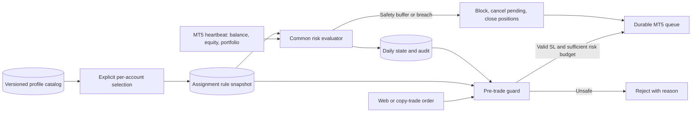

# Prop Risk Guard — Automated Prop-Account Protection on the Web

Status: implemented for the MT5 web execution path. The evaluator is
provider-neutral, and selectable profiles come from a versioned PostgreSQL
catalog. FTMO profiles are initial seed data, not hardcoded evaluator or UI
branches.

## Goals

Prop Risk Guard removes the need for prop-account traders to calculate
drawdown manually before every order. A user first selects and confirms the
correct provider program and stage for each account, then configures protection
once in the web application. The system then:

- stores an explicit, versioned profile assignment for that account;
- validates every order **before** it enters the MT5 command queue;
- requires a Stop Loss when the selected profile requires one;
- limits risk per order and combined risk across positions and pending orders;
- automatically reduces quantity to the largest safe lot step instead of
  requiring the user to recalculate it, rejecting only when the remaining
  budget is below the broker's minimum quantity;
- prevents Stop Loss and pending-entry modifications from increasing committed
  risk;
- tracks equity from account heartbeats using the firm's trading day and time
  zone;
- automatically blocks new orders, cancels pending orders, and closes positions
  when the safety buffer is reached;
- keeps the account locked for the remainder of the trading day so a price
  recovery cannot silently reopen trading; and
- writes audit records for configuration changes, rejected orders, and the
  first daily lock.

This is a **web/backend feature**, not firm-specific EA logic. The common EA
continues to act only as a transport, telemetry publisher, and executor of
commands approved by the backend.

## Automated Flow



## Explicit Account and Stage Selection

Catalog profiles are choices, not account classifiers. The guard never infers
`1-Step`, `2-Step`, `Challenge`, `Verification`, or `Account` from an MT5 login,
server name, broker label, balance, or the provider name alone. A newly seen
execution account has no implicit stage and must remain unassigned until the
user selects a profile and saves it. The UI must not silently save the first
catalog row as a default.

The assignment stores `profile_id`, `profile_version`, provider/program
metadata, capital, rules, and actions as a per-account snapshot. Publishing a
new catalog version therefore does not silently rewrite protection on an
existing account. When the provider advances or replaces an account, the user
must explicitly select the new stage and confirm its capital.

No manual daily reset is required. PostgreSQL derives `trading_day` from the
profile's IANA time zone and captures `day_start_balance` from the first
heartbeat observed while protection is active for that trading day. Once
captured, that baseline is immutable for the rest of the day. A real lock also
remains sticky until the next trading day.

If two first heartbeats race at a day boundary, PostgreSQL keeps the baseline
from the winning insert. The losing evaluation is not allowed to overwrite or
lock that row using its different candidate baseline; the gateway reloads the
stored baseline and evaluates that heartbeat again before applying actions.

When protection is first enabled mid-day, no trustworthy continuously observed
midnight snapshot exists. The common runtime therefore uses the live balance
from the first protected heartbeat and fails closed until that evaluation is
stored. It never substitutes or clamps this daily baseline with
`initial_balance`: starting capital determines the configured allowance and
static maximum-loss floor, while the observed balance anchors the current
trading day. Re-saving settings or reconciling starting capital does not rewrite
an already captured same-day baseline. Losses from before activation cannot be
reconstructed by the web guard. Current equity is still checked against the
maximum-loss reference the guard can prove, but the provider's own record
remains authoritative for any earlier high-water mark or breach.

The runtime preserves genuine daily locks, but it can repair locks produced by
the legacy initial-balance daily-floor regression when the stored evidence is
conclusive. A repair requires the original append-only lock audit, an unchanged
rule snapshot, legacy-formula metrics, and a recorded `min_equity` that stayed
strictly above both corrected emergency floors for the entire observed day.
Missing, malformed, or ambiguous evidence remains fail-closed until the normal
time-zone reset. The repair preserves `day_start_balance`, hides the stale
evaluation, writes its own audit record, and lets the same heartbeat persist a
fresh evaluation.

## Common Rule Strategies and Formulas

Rates are stored as basis points (`100 bp = 1%`). Monetary allowances are
calculated from the confirmed `initial_balance`, while each strategy chooses
the reference used to place its floor:

```text
daily_loss_limit = initial_balance × daily_loss_limit_bp / 10,000
max_loss_limit   = initial_balance × max_loss_limit_bp / 10,000

daily_reference = day_start_balance
daily_floor     = daily_reference - daily_loss_limit

static_max_reference = initial_balance
eod_trailing_reference = max(initial_balance, highest_prior_eod_balance)
max_floor = selected_max_reference - max_loss_limit

daily_remaining = equity - daily_floor
max_remaining   = equity - max_floor
```

`dailyLossReference` and `maxLossMode` are strategy fields in profile data.
Current official seeds use `startOfDayBalance` for daily loss and either
`static` or `endOfDayTrailing` for maximum loss. The EOD-trailing high-water
mark can rise only from completed prior trading-day balances observed by the
guard; it never falls because the current balance fell.

The same common evaluator also supports optional
`profitTargetBasisPoints`, `bestDayLimitBasisPoints`, and
`minimumTradingDays`. Overall profit is measured from confirmed starting
capital and is marked complete only when the target balance is reached with no
open position. Best Day compares the largest positive daily result with total
positive-days profit. Minimum Trading Days is a declared objective whose result
remains unknown unless the runtime has authoritative lifecycle history.

`initial_balance` is the account's original or provider-confirmed simulated
capital, never the current balance. A profile declares a `capital_mode`. In
`reference_balances` mode, the shared
resolver selects the declared capital with the smallest relative deviation from
the observed account balance and selects the larger capital on an exact tie as
the fail-safe choice. Relative deviation avoids incorrectly preferring a much
smaller account tier after a drawdown. Profiles in `manual` mode require the
user to enter and confirm capital. This is intentional for funded/account
stages: scaling, merging, reward processing, or account replacement can produce
capital that does not match a challenge-size list. A `reference_balances`
profile with no valid reference fails
closed instead of falling back to the live balance. The same profile-driven rule
is enforced in the UI and again by the backend, so a modified client cannot
weaken the floor. Existing assignments created with a live balance are
reconciled automatically without changing their captured current-day baseline,
and stale evaluations are hidden until the next heartbeat recalculates them.
While that heartbeat is pending, the web card refreshes automatically.

For example, an account observed at `45,698.07` with a `50,000` reference and a
10% static maximum loss has a `45,000` floor and only `698.07` total loss
headroom. It does **not** receive a new 10% allowance based on `45,698.07`.
If that observation is also the first protected heartbeat of the trading day,
`45,698.07` is the daily baseline: the configured 5% daily allowance remains
`2,500`, while the smaller `698.07` static-loss headroom is still the binding
limit.

The evaluator uses **equity**, so floating P/L, commission, and swap are
included whenever the broker reflects them in equity. Before accepting a new
order, the backend also calculates:

```text
planned_risk = abs(entry - stop_loss) / tick_size × tick_value × quantity
projected_committed_risk = open_position_risk + pending_order_risk + planned_risk
```

An order cannot consume more than the per-trade limit, combined committed-risk
limit, daily budget, or total budget after the emergency buffer is reserved. If
some budget remains, the backend floors quantity to the broker's
`quantity_step` and returns `QUANTITY_CAPPED_BY_PROP_RISK` with the queued
result.

## Official FTMO Seed Profiles

Migration `0036_execution_prop_risk_profile_catalog` seeds the following
active records. These values are rows in the catalog and snapshots in account
assignments; neither the evaluator nor shared UI checks `provider_code == ftmo`.

| Selectable profile | Daily loss | Maximum loss | Overall target | Best Day | Minimum days | Capital |
| --- | ---: | --- | ---: | ---: | ---: | --- |
| FTMO 1-Step Challenge | 3% | 10%, EOD trailing | 10% | 50% | — | 10k/25k/50k/100k/200k references |
| FTMO 1-Step Account | 3% | 10%, EOD trailing | — | 50% | — | Manual confirmation |
| FTMO 2-Step Challenge v2 | 5% | 10%, static | 10% | — | 4 | 10k/25k/50k/100k/200k references |
| FTMO Verification v2 | 5% | 10%, static | 5% | — | 4 | 10k/25k/50k/100k/200k references |
| FTMO 2-Step Account | 5% | 10%, static | — | — | — | Manual confirmation |

The catalog retains the former 2-Step v1 rows as inactive compatibility
versions so existing assignment snapshots remain identifiable, but they are
not offered for new selection. `custom_prop_firm` is an active unlocked
template for a provider or program whose terms the user has independently
verified.

Official FTMO objective fields are locked in both the UI and backend. A payload
cannot loosen an objective while retaining the official label. The
application-level 1% per-trade limit, 3% combined open-risk limit, Stop Loss
requirement, warning buffer, emergency buffer, and automated actions are
initial local-policy defaults; they remain configurable per account and are not
represented as additional FTMO objectives.

Official sources verified on 2026-08-10:

- [FTMO Trading Objectives](https://ftmo.com/en/trading-objectives/)
- [FTMO Maximum Daily Loss](https://academy.ftmo.com/lesson/maximum-daily-loss/)
- [FTMO Maximum Loss](https://academy.ftmo.com/lesson/maximum-loss/)
- [FTMO Scaling Plan](https://ftmo.com/en/reward-growth-and-scaling-plan/)
- [FTMO account allocation and merging entry point](https://ftmo.com/en/faq/how-many-accounts-can-i-have/)

## Provider-Neutral Catalog Architecture

The core evaluator has no provider-specific branch. PostgreSQL stores each
profile version as a data object containing:

- identity: `profile_id`, `profile_version`, `provider_code`, and
  `program_code`;
- calendar: an IANA `timezone`;
- capital policy: `capital_mode` plus optional `reference_balances`, consumed by
  the common starting-capital resolver;
- edit policy: `rules_locked`, rather than checks against a provider or profile
  ID;
- rules: daily-loss reference, static or EOD-trailing maximum loss, overall
  profit target, Best Day limit, Minimum Trading Days, per-trade and combined
  risk, Stop Loss, warning/emergency buffers, and an optional daily target; and
- actions: block new orders, cancel pending orders, close positions, lock after
  a target, and fail closed when telemetry is stale.

To add another provider or program that uses supported strategies:

1. verify its rules from an official source;
2. insert a new versioned catalog row, increasing its version whenever rules,
   actions, verification date, or capital policy change;
3. leave the evaluator, Go BFF, React form, and EA unchanged; and
4. add test vectors for equity floors, time-zone reset behavior, and profile
   actions.

The `custom_prop_firm` profile allows rules and time zones to be configured on
the web. A fundamentally different rule model should be added once as a generic
data strategy in the domain rather than as provider-specific code or UI logic.
Catalog membership, capital policy, and rule editability are independent: an
editable future profile can still require common reference-balance resolution.

## API and Data Model

The browser calls only authenticated endpoints:

- `GET /api/v1/execution/prop-risk?accountId=...`
- `POST /api/v1/execution/prop-risk`

Go ignores client-supplied identity and injects the user ID from the
authenticated session. Rust verifies ownership again before every read or
write. The corresponding `/v1/admin/prop-risk` route is loopback-only and is
never exposed publicly.

Migration `0034_execution_prop_risk_guard` creates:

- `execution_prop_risk_assignments`: per-account snapshots of profiles, rules,
  and actions; and
- `execution_prop_risk_daily_state`: the baseline, minimum equity, status,
  reason, lock, and evaluation for each trading day.

Migration `0036_execution_prop_risk_profile_catalog` creates
`execution_prop_risk_profiles`, validates identifiers, capital modes, rule and
action JSON, keeps only one active version per profile ID, and seeds official
and custom templates. Runtime catalog reads come from this table. Assignments
remain immutable snapshots so disabling or superseding a catalog version does
not reinterpret historical configuration.

## Fail-Safe Behavior and Operational Limits

- When `fail_closed_on_stale_data` is enabled, new orders are rejected until
  the first daily heartbeat is available and whenever quotes or metadata are
  insufficient to calculate risk.
- A safety buffer reduces the probability of a breach caused by spread,
  slippage, or latency, but it cannot guarantee protection during a market gap
  or broker outage.
- Trades submitted directly outside the web can still appear. The next
  heartbeat detects their equity and portfolio impact. Exposure without a Stop
  Loss locks the trading day and triggers the emergency action, but the backend
  cannot block an order before another terminal sends it directly to the
  broker.
- Users must still select the correct program and verify the official rules for
  their account. Starting capital is automatic only when that profile declares
  reference balances; profiles without them retain manual capital entry.
  Similar commercial names do not guarantee identical account conditions.
- History begins when protection starts. The guard does not import the firm's
  complete pre-activation Account MetriX or broker deal ledger, so it cannot
  reconstruct an earlier EOD high-water mark, intraday low, positive day, Best
  Day, or trading-day count. Re-enabling protection does not manufacture that
  missing evidence.
- Stored daily minima are minima of received heartbeat samples. A move between
  samples, an MT5 outage, or a direct external trade can be observed late or
  missed; the provider remains the authority on whether an objective was
  breached.
- Current Best Day history uses observed daily balance deltas, not a complete
  closed-deal ledger. It can be distorted by mid-day activation, missing days,
  reward withdrawals, rollover, scaling, merging, or account replacement.
  Treat it as informational until full provider-quality history is available.
- Minimum Trading Days is stored as an objective, but current MT5 telemetry
  does not prove the number of days on which a position was opened. The result
  must remain unknown rather than being guessed from heartbeat days.
- EOD-trailing maximum loss uses the highest completed EOD balance retained by
  the guard. For an already-progressed or replaced account, confirm the current
  official floor outside the application before enabling protection.
