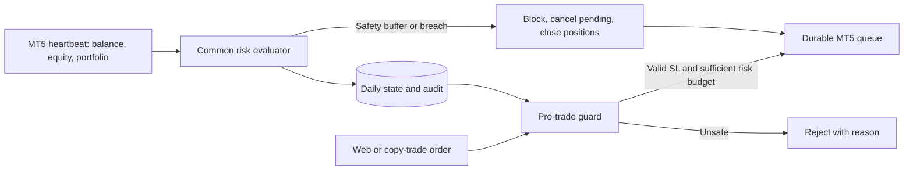

# Prop Risk Guard — Automated Prop-Account Protection on the Web

Status: implemented for the MT5 web execution path. The evaluator is
broker-neutral; FTMO 2-Step is the first versioned preset.

## Goals

Prop Risk Guard removes the need for prop-account traders to calculate
drawdown manually before every order. A user configures protection once for
each account in the web application; the system then:

- validates every order **before** it enters the MT5 command queue;
- requires a Stop Loss when the selected profile requires one;
- limits risk per order and combined risk across positions and pending orders;
- automatically reduces quantity to the largest safe lot step instead of
  requiring the user to recalculate it, rejecting only when the remaining
  budget is below the broker's minimum quantity;
- prevents Stop Loss and pending-entry modifications from increasing committed
  risk;
- tracks equity from account heartbeats using the firm's trading day and time
  zone;
- automatically blocks new orders, cancels pending orders, and closes positions
  when the safety buffer is reached;
- keeps the account locked for the remainder of the trading day so a price
  recovery cannot silently reopen trading; and
- writes audit records for configuration changes, rejected orders, and the
  first daily lock.

This is a **web/backend feature**, not firm-specific EA logic. The common EA
continues to act only as a transport, telemetry publisher, and executor of
commands approved by the backend.

## Automated Flow



No manual daily reset is required. PostgreSQL derives `trading_day` from the
profile's IANA time zone and captures `day_start_balance` from the first
heartbeat observed while protection is active for that trading day. Once
captured, that baseline is immutable for the rest of the day. A real lock also
remains sticky until the next trading day.

If two first heartbeats race at a day boundary, PostgreSQL keeps the baseline
from the winning insert. The losing evaluation is not allowed to overwrite or
lock that row using its different candidate baseline; the gateway reloads the
stored baseline and evaluates that heartbeat again before applying actions.

When protection is first enabled mid-day, no trustworthy continuously observed
midnight snapshot exists. The common runtime therefore uses the live balance
from the first protected heartbeat and fails closed until that evaluation is
stored. It never substitutes or clamps this daily baseline with
`initial_balance`: starting capital determines the configured allowance and
static maximum-loss floor, while the observed balance anchors the current
trading day. Re-saving settings or reconciling starting capital does not rewrite
an already captured same-day baseline. Losses from before activation cannot be
reconstructed by the web guard; they remain covered by the static maximum-loss
check and the venue's own enforcement.

The runtime preserves genuine daily locks, but it can repair locks produced by
the legacy initial-balance daily-floor regression when the stored evidence is
conclusive. A repair requires the original append-only lock audit, an unchanged
rule snapshot, legacy-formula metrics, and a recorded `min_equity` that stayed
strictly above both corrected emergency floors for the entire observed day.
Missing, malformed, or ambiguous evidence remains fail-closed until the normal
time-zone reset. The repair preserves `day_start_balance`, hides the stale
evaluation, writes its own audit record, and lets the same heartbeat persist a
fresh evaluation.

## Common Formulas

Rates are stored as basis points (`100 bp = 1%`) and calculated from
`initial_balance`:

```text
daily_loss_limit = initial_balance × daily_loss_limit_bp / 10,000
max_loss_limit   = initial_balance × max_loss_limit_bp / 10,000

daily_floor = day_start_balance - daily_loss_limit
max_floor   = initial_balance   - max_loss_limit

daily_remaining = equity - daily_floor
max_remaining   = equity - max_floor
```

`initial_balance` is the account's starting capital, never the current balance.
A profile declares a `capital_mode`. In `reference_balances` mode, the shared
resolver selects the declared capital with the smallest relative deviation from
the observed account balance and selects the larger capital on an exact tie as
the fail-safe choice. Relative deviation avoids incorrectly preferring a much
smaller account tier after a drawdown. Profiles in `manual` mode keep manual
capital entry. A `reference_balances` profile with no valid reference fails
closed instead of falling back to the live balance. The same profile-driven rule
is enforced in the UI and again by the backend, so a modified client cannot
weaken the floor. Existing assignments created with a live balance are
reconciled automatically without changing their captured current-day baseline,
and stale evaluations are hidden until the next heartbeat recalculates them.
While that heartbeat is pending, the web card refreshes automatically.

For example, an account observed at `45,698.07` with a `50,000` reference and a
10% static maximum loss has a `45,000` floor and only `698.07` total loss
headroom. It does **not** receive a new 10% allowance based on `45,698.07`.
If that observation is also the first protected heartbeat of the trading day,
`45,698.07` is the daily baseline: the configured 5% daily allowance remains
`2,500`, while the smaller `698.07` static-loss headroom is still the binding
limit.

The evaluator uses **equity**, so floating P/L, commission, and swap are
included whenever the broker reflects them in equity. Before accepting a new
order, the backend also calculates:

```text
planned_risk = abs(entry - stop_loss) / tick_size × tick_value × quantity
projected_committed_risk = open_position_risk + pending_order_risk + planned_risk
```

An order cannot consume more than the per-trade limit, combined committed-risk
limit, daily budget, or total budget after the emergency buffer is reserved. If
some budget remains, the backend floors quantity to the broker's
`quantity_step` and returns `QUANTITY_CAPPED_BY_PROP_RISK` with the queued
result.

## FTMO 2-Step v1 Preset

| Rule | Step 1 | Step 2 |
| --- | ---: | ---: |
| Maximum Daily Loss | 5% | 5% |
| Maximum Loss | 10% | 10% |
| Application default maximum risk per trade | 1% | 1% |
| Application default combined position and pending risk | 3% | 3% |
| Warning buffer | 1% | 1% |
| Emergency buffer | 0.5% | 0.5% |
| Reset time zone | `Europe/Prague` | `Europe/Prague` |
| Reference balances | 10k, 25k, 50k, 100k, 200k | 10k, 25k, 50k, 100k, 200k |
| Stop Loss | Required | Required |
| Automatic block, cancel, and close | Enabled | Enabled |

The 5% and 10% limits reflect FTMO documentation when profile v1 was created.
The 1% and 3% limits and the safety buffers are application safety policies,
not additional requirements published by FTMO. If a firm changes its rules, a
new profile version must be created instead of silently modifying a profile
already assigned to accounts.

All rules and actions in a system preset are locked in both the UI and backend.
A payload therefore cannot loosen 5% to 8% while still saving the configuration
under the FTMO label. Users who need different thresholds must select
`custom_prop_firm`.

Sources verified on 2026-08-06:

- [DAOEA Prop Safe Pro](https://daoea.co/ea/prop-safe-pro)
- [FTMO Maximum Daily Loss](https://academy.ftmo.com/lesson/maximum-daily-loss/)
- [FTMO Maximum Loss](https://academy.ftmo.com/lesson/maximum-loss/)
- [FTMO Trading Objectives](https://ftmo.com/en/trading-objectives/)
- [FTMO Challenge sizes](https://ftmo.com/en/how-it-works/)

## Open Architecture for Future Firms

The core evaluator has no `if provider == FTMO` branch. Each profile is only a
versioned data object containing:

- identity: `profile_id`, `profile_version`, `provider_code`, and
  `program_code`;
- calendar: an IANA `timezone`;
- capital policy: `capital_mode` plus optional `reference_balances`, consumed by
  the common starting-capital resolver;
- edit policy: `rules_locked`, rather than checks against a provider or profile
  ID;
- rules: daily and maximum loss, per-trade and combined risk, Stop Loss,
  warning and emergency buffers, and an optional daily profit target; and
- actions: block new orders, cancel pending orders, close positions, lock after
  a target, and fail closed when telemetry is stale.

To add another firm with the same drawdown model:

1. verify its rules from an official source;
2. add a new `PropRiskProfileTemplate`, increasing its version whenever the
   rules or capital policy change;
3. leave the evaluator, Go BFF, React form, and EA unchanged; and
4. add test vectors for equity floors, time-zone reset behavior, and profile
   actions.

The `custom_prop_firm` profile allows rules and time zones to be configured on
the web without a deployment. Fundamentally different rule models, such as a
trailing drawdown based on a high-water mark, should be added as a new data
strategy in the domain rather than as broker-specific code or UI logic.
Catalog membership, capital policy, and rule editability are independent: an
editable future profile can still require common reference-balance resolution.

## API and Data Model

The browser calls only authenticated endpoints:

- `GET /api/v1/execution/prop-risk?accountId=...`
- `POST /api/v1/execution/prop-risk`

Go ignores client-supplied identity and injects the user ID from the
authenticated session. Rust verifies ownership again before every read or
write. The corresponding `/v1/admin/prop-risk` route is loopback-only and is
never exposed publicly.

Migration `0034_execution_prop_risk_guard` creates:

- `execution_prop_risk_assignments`: per-account snapshots of profiles, rules,
  and actions; and
- `execution_prop_risk_daily_state`: the baseline, minimum equity, status,
  reason, lock, and evaluation for each trading day.

## Fail-Safe Behavior and Operational Limits

- When `fail_closed_on_stale_data` is enabled, new orders are rejected until
  the first daily heartbeat is available and whenever quotes or metadata are
  insufficient to calculate risk.
- A safety buffer reduces the probability of a breach caused by spread,
  slippage, or latency, but it cannot guarantee protection during a market gap
  or broker outage.
- Trades submitted directly outside the web can still appear. The next
  heartbeat detects their equity and portfolio impact. Exposure without a Stop
  Loss locks the trading day and triggers the emergency action, but the backend
  cannot block an order before another terminal sends it directly to the
  broker.
- Users must still select the correct program and verify the official rules for
  their account. Starting capital is automatic only when that profile declares
  reference balances; profiles without them retain manual capital entry.
  Similar commercial names do not guarantee identical account conditions.
