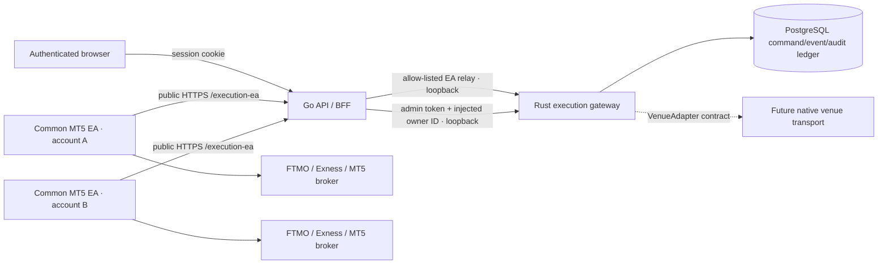

# Trade execution architecture

Status: production MT5 path implemented; native exchange transports remain
fail-closed until their credential, signing, rate-limit, and reconciliation
implementations are complete.

## Goals

- Keep Trade as a first-class workspace instead of a resizable bottom-panel tab.
- Support any number of user-owned execution accounts without sharing identity,
  credentials, commands, or portfolio state between users.
- Use one broker-neutral EA for FTMO, Exness, and other MetaTrader 5 brokers.
- Route one order to multiple targets with deterministic per-target sizing,
  symbol mapping, risk validation, idempotency, and independently visible
  outcomes.
- Keep the latency-sensitive routing and command lifecycle in Rust.
- Add future venues through a shared domain and adapter contract instead of
  broker-specific React, Go handlers, or risk forks.
- Fail closed whenever ownership, account state, broker metadata, quote
  freshness, transport availability, or a risk input cannot be proven.

## Runtime boundaries

The browser never receives the Rust admin token and never supplies an owner ID.
Go derives the owner from the authenticated server session, validates the
browser payload, and injects the owner only on the loopback call to Rust.

The public EA surface and the loopback admin surface are separate listeners:

| Surface | Default | Caller | Exposure |
| --- | --- | --- | --- |
| Go API + EA relay | `127.0.0.1:8080` | browser and common MT5 EA | existing public HTTPS API proxy |
| Rust EA | `127.0.0.1:8790` | Go EA relay | loopback only |
| Rust admin | `127.0.0.1:8791` | Go BFF | loopback only; never public |
| MT5 market data | `127.0.0.1:8765` | Go backend | loopback only; read-only |

Rust refuses a non-loopback bind. Go exposes only four exact `/execution-ea`
routes and never forwards an admin path. The reverse proxy owns TLS,
request-rate limits, connection limits, and public path filtering.

## Account model

One MT5 terminal can have one active login. Multi-account support therefore
runs one terminal instance per account and attaches the same
`SMCExecutionEA.ex5` to each instance.

The first connection uses a 256-bit, owner-bound, one-use pairing token with a
maximum ten-minute lifetime. Rust derives a stable account ID from the
authenticated owner, MT5 server, and login. This means:

- identical broker logins owned by different application users cannot collide;
- changing MT5 account identity invalidates the cached session;
- the application never asks for or stores an MT5 password;
- Demo and Live use the same code path;
- Live is not blocked because it is Live, but broker trade permission, Algo
  Trading, account policy, and all risk checks still apply.

EA sessions are stored as hashes in PostgreSQL, have a sliding inactivity
expiry and an absolute expiry, and are revocable. The raw bearer token exists
only in the terminal sandbox. The EA refuses public plain HTTP gateway URLs;
HTTP is accepted only for loopback development.

## Order and copy-routing flow

1. The browser builds one canonical order intent and explicitly selected target
   allocations.
2. Go authenticates the request and injects its owner ID.
3. Rust loads each target by the composite owner/account boundary.
4. The target canonical symbol is resolved through its server-persisted mapping
   to an instrument reported by that exact account.
5. Rust checks account readiness, terminal trade permission, symbol policy,
   quote freshness, stop direction/distance, quantity units, broker min/max/step
   constraints, and account risk limits.
6. Every accepted target receives a target-scoped command ID and idempotency
   key. A rejected target does not cancel or hide other target results.
7. PostgreSQL stores the command before delivery. Polling leases rather than
   removes commands, so a network interruption causes bounded redelivery until
   a terminal acknowledgement exists.
8. The EA records `submitting` in its local journal before `OrderSend`, performs
   `OrderCheck`, submits once, and reconciles ambiguous results from active and
   historical MT5 state. It never blindly repeats an unknown submission.
9. EA events, portfolio snapshots, command outcomes, and security audit records
   are persisted before the API reports success.

Copy allocation modes share the same route:

- same quantity;
- multiplier;
- equity-proportional;
- risk percent;
- per-target maximum quantity.

Cross-venue quantity units are rejected unless a future adapter provides an
explicit, tested conversion. Lots are never silently interpreted as base units,
contracts, or quote notional.

## Lifecycle commands

Modify, close, partial close, and cancel requests are target-scoped. Before
queueing, Rust verifies that the referenced position or pending order belongs
to the authenticated owner and target account. Close quantity cannot exceed the
current position. Protection prices are checked against position side and the
latest broker minimum stop distance.

`Close All` is split into one durable command per observed position. This avoids
an opaque bulk operation and makes every broker result independently auditable.

## Symbol portability

Chart symbols are canonical identifiers. Each target reports its actual MT5
instrument catalog, including suffixes and contract metadata. A user mapping
can only point to a venue symbol reported by that target account.

The browser does not send a venue symbol in an order. Rust resolves the mapping
from PostgreSQL, which prevents a modified browser from selecting an arbitrary
broker instrument.

## Venue extension contract

New brokers share:

- `OrderIntent`, `RoutedOrder`, account and portfolio domain types;
- decimal-string wire values;
- the deterministic execution engine;
- risk policy and copy-allocation logic;
- command IDs, idempotency, events, and audit schemas;
- the Trade workspace and account registry.

A new venue implements `VenueAdapter` plus its account/instrument/portfolio
synchronizer. It must publish capabilities and quantity units rather than
adding broker conditionals to the engine.

FTMO, Exness, and other MT5 brokers use the production common-EA adapter.
`binanceSpot` and `binanceUsdM` domain values exist to keep the schema and wire
contract forward-compatible, but the deployment deliberately returns
`NATIVE_ADAPTER_NOT_ENABLED` until a concrete native transport is registered.
An enum or trait stub is not considered production Binance support.

## Production readiness matrix

| Capability | State | Production gate |
| --- | --- | --- |
| Top-level Trade workspace | implemented | responsive visual and interaction QA |
| Multi-account MT5 | implemented | one common EA per terminal/account |
| FTMO and Exness execution | implemented | broker-neutral MT5 path |
| Demo and Live | implemented | identical path; no mode block |
| Multi-target order copy | implemented | independent Rust risk and outcome per target |
| Persistent commands/events/audit | implemented | PostgreSQL required; no in-memory production |
| Modify/close/cancel | implemented | owner/resource validation before queue |
| Native Binance | disabled | signing, secure secret storage, clock sync, filters, rate limits, portfolio sync, reconciliation, and sandbox/live certification required |

## Native Binance completion plan

Native Binance must be completed as a separate, fail-closed production
vertical:

1. Add authenticated account onboarding with trade-only API keys, explicit IP
   restrictions, key rotation, revocation, and envelope-encrypted secret
   storage. Never send a secret to the browser after creation.
2. Implement official Spot and USD-M signing with server-time synchronization,
   `recvWindow`, canonical query encoding, filter refresh, bounded retries, and
   exchange error normalization.
3. Use client order IDs derived from target idempotency keys and reconcile all
   timeout/unknown responses through query endpoints before considering a
   resubmission.
4. Stream and periodically reconcile balances, positions, open orders, fills,
   and symbol filters into the shared account/instrument/portfolio tables.
5. Implement exchange weight accounting, backoff, circuit breaking, and proxy
   egress allow-lists.
6. Add Binance testnet integration tests and a separately approved mainnet
   canary with minimal notional limits.
7. Register the transport only after the full suite passes. Until then Rust
   rejects the venue before command creation.

## Official platform constraints

- MT5 `WebRequest` is synchronous and requires the URL in the terminal
  allow-list.
- MT5 trade callbacks can arrive in multiple unordered stages, so the EA keeps
  callbacks bounded and sends network events from its timer.
- A successful `OrderSend` call is not itself proof of a fill; broker events
  and state reconciliation are authoritative.
- Binance signed trading endpoints require an API key, signature, timestamp,
  and replay window handling.

See `TRADE_PRODUCTION_SECURITY_RUNBOOK.md` for deployment and incident gates.
