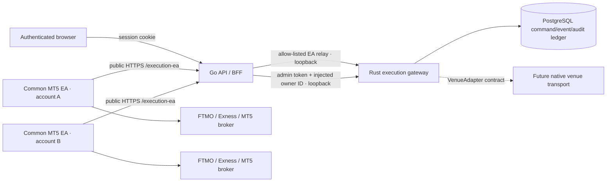

# Trade execution architecture

Status: production MT5 path implemented; native exchange transports remain
fail-closed until their credential, signing, rate-limit, and reconciliation
implementations are complete.

The approved web-only MT5 transport is specified in
[`UNIVERSAL_MT5_WINDOWS_VM_CONNECTOR_PLAN.md`](UNIVERSAL_MT5_WINDOWS_VM_CONNECTOR_PLAN.md).
It is additive to the current EA path and uses private Windows VMs with a Rust
multi-terminal supervisor. Phase 3 credential routes and capability-driven UI
are implemented but remain disabled by default; do not treat the no-install flow
as production-active until the Phase 1-3 operational gates pass. Order execution
remains outside this phase.

## Goals

- Keep Trade as a first-class workspace instead of a resizable bottom-panel tab.
- Support any number of user-owned execution accounts without sharing identity,
  credentials, commands, or portfolio state between users.
- Use one broker-neutral EA for FTMO, Exness, and other MetaTrader 5 brokers.
- Route one order to multiple targets with deterministic per-target sizing,
  symbol mapping, risk validation, idempotency, and independently visible
  outcomes.
- Keep the latency-sensitive routing and command lifecycle in Rust.
- Add future venues through a shared domain and adapter contract instead of
  broker-specific React, Go handlers, or risk forks.
- Fail closed whenever ownership, account state, broker metadata, quote
  freshness, transport availability, or a risk input cannot be proven.

The account-level prop-firm safety layer is documented in
[Prop Risk Guard](PROP_RISK_GUARD.md), including FTMO v1 formulas, automatic
actions, profile-driven starting-capital resolution, API/data boundaries, and
the extension path for future firms. Provider names never branch the common
evaluator or React form.

## Runtime boundaries

The browser never receives the Rust admin token and never supplies an owner ID.
Go derives the owner from the authenticated server session, validates the
browser payload, and injects the owner only on the loopback call to Rust.

Trade projections in the browser are session-scoped as well as server-owned.
Logout or any Firebase identity change immediately invalidates the frontend
backend-session flag and clears the account registry, selection/layout, copy
targets, Simulator account/positions/equity, MT5 account/risk/portfolio and
instrument snapshots, Activity history and pending commands. Polling is stopped
before reset, and in-flight responses are cancellation-guarded, so an old
identity cannot repopulate the signed-out or next-user workspace. Server owner
checks remain the authoritative execution boundary; the frontend reset prevents
previous-user metadata from remaining visible on a shared browser.

The public EA surface and the loopback admin surface are separate listeners:

| Surface | Default | Caller | Exposure |
| --- | --- | --- | --- |
| Go API + EA relay | `127.0.0.1:8080` | browser and common MT5 EA | existing public HTTPS API proxy |
| Rust EA | `127.0.0.1:8790` | Go EA relay | loopback only |
| Rust admin | `127.0.0.1:8791` | Go BFF | loopback only; never public |
| MT5 market data | `127.0.0.1:8765` | Go backend | loopback only; read-only |

Rust refuses a non-loopback bind. Go exposes only four exact `/execution-ea`
routes and never forwards an admin path. The reverse proxy owns TLS,
request-rate limits, connection limits, and public path filtering.

## Account model

One MT5 terminal can have one active login. Multi-account support therefore
runs one terminal instance per account and attaches the same
`MarketLensExecutionEA.ex5` to each instance.

Users download the common compiled EA directly from the authenticated Trade
workspace. The same-origin `/downloads/MarketLensExecutionEA.ex5` release is packaged
with a SHA-256 checksum and a manifest binding the compiled binary to the
current `.mq5` source. Repository or backend filesystem paths are never exposed
as installation instructions.

The first connection uses a 256-bit, owner-bound, one-use pairing token with a
maximum ten-minute lifetime. Rust derives a stable account ID from the
authenticated owner, MT5 server, and login. This means:

- identical broker logins owned by different application users cannot collide;
- changing MT5 account identity invalidates the cached session;
- the application never asks for or stores an MT5 password;
- Demo and Live use the same code path;
- Live is not blocked because it is Live, but broker trade permission, Algo
  Trading, account policy, and all risk checks still apply.

EA sessions are stored as hashes in PostgreSQL, have a sliding inactivity
expiry and an absolute expiry, and are revocable. The raw bearer token exists
only in the terminal sandbox. The EA refuses public plain HTTP gateway URLs;
HTTP is accepted only for loopback development.

Session activity and execution readiness are deliberately different signals.
Any authenticated EA request refreshes session expiry, but only a completely
successful `POST /v1/ea/poll` records `last_poll_at`. An MT5 account is
executable only while that poll timestamp is no more than 15 seconds old.
Consequently, event heartbeats or portfolio snapshots cannot hide a broken
command channel.

Each account snapshot also includes the common EA release version. The current
minimum is `1.25`; a missing, malformed, or older version is blocked before
command creation. The gateway publishes this minimum to the Go BFF so the
account registry and order router cannot disagree about readiness. EA 1.25
retains in-place pending-order entry/SL/TP modification and adds the current
copier telemetry and broker-margin safety contract. The additive version field
prevents a gateway from delivering a command that an older terminal would
silently ignore.

Portfolio synchronization is isolated from auxiliary telemetry. Rust commits
validated open positions and pending orders before it validates/persists
instrument discovery and command events, so an unrelated metadata failure
cannot roll back user-visible money state. EA 1.25 retains the independent
portfolio, command-outcome, and instrument lanes introduced in 1.23, each with
bounded backoff and lane-specific diagnostics.

### Account rail ordering

The Trade account rail is user-owned workspace state, not execution authority.
It stores an ordered list of opaque item IDs in
`execution_account_layouts`, including the current `simulator:<id>` item and
broker execution-account IDs. The frontend merges this list with the live
registry: missing/deleted entries are discarded and newly connected accounts
append without requiring a migration or broker-specific code.

Pointer reordering starts from the full account card, consistent with Watchlist
rows, while the management button is explicitly excluded. Once movement crosses
the shared two-axis threshold, window-level pointer listeners own the gesture so
leaving the source card cannot lose the drop. The source card is translated
vertically above its reserved layout slot and becomes pointer-transparent, so
the row beneath it still resolves an accurate drop edge. Pointer cancel or
window blur aborts without persistence; a valid release resolves the final row
half and writes the complete order. The visible grip remains a keyboard reorder
control with Arrow Up/Down and an accessible saved-state announcement.

The browser reads and writes the layout only through authenticated
`GET/POST /api/v1/execution/account-layout`. Go ignores any client owner
identity, injects the authenticated user ID, and forwards to the loopback Rust
admin surface. Rust validates bounds, uniqueness and identifiers, permits at
most one simulator item, and verifies every broker account belongs to that
owner. Full-list writes use `expectedRevision`; stale devices receive `409`
instead of silently overwriting a newer order. Successful writes are
transactional and recorded as `account.layout_updated` in the execution audit
log.

## Order and copy-routing flow

1. The browser builds one canonical order intent and explicitly selected target
   allocations.
2. Go authenticates the request and injects its owner ID.
3. Rust loads each target by the composite owner/account boundary.
4. The target canonical symbol is resolved through its server-persisted mapping
   to an instrument reported by that exact account.
5. Rust checks a fresh successful EA command poll, minimum EA version, account
   readiness, terminal trade permission, symbol policy, quote freshness, stop
   direction/distance, quantity units, broker min/max/step constraints, and
   account risk limits.
6. Every accepted target receives a target-scoped command ID and idempotency
   key. A rejected target does not cancel or hide other target results.
7. An offline MT5 target is persisted as `waiting` with a five-minute
   `deliver_by` deadline. When its EA reconnects and publishes a fresh account
   and instrument snapshot, Rust repeats the complete route/risk validation.
   A successful revalidation changes the same durable target command to
   `queued`; a failed revalidation is terminal and remains visible.
8. PostgreSQL stores the command before delivery. Polling leases rather than
   removes commands, so a network interruption causes bounded redelivery until
   a terminal acknowledgement exists.
9. The EA records `submitting` in its local journal before `OrderSend`, performs
   `OrderCheck`, submits once, and reconciles ambiguous results from active and
   historical MT5 state. It never blindly repeats an unknown submission.
10. EA events, portfolio snapshots, command outcomes, and security audit records
   are persisted before the API reports success.

Delivery has two distinct deadline outcomes:

- `DELIVERY_UNAVAILABLE`: no successful EA poll leased the command before its
  bounded delivery deadline. `attempt_count=0` and `first_delivered_at IS NULL`
  are authoritative evidence that MT5 never received it; this is terminal.
- `DELIVERY_OUTCOME_UNKNOWN`: the command was leased to the EA at least once,
  but no terminal command outcome was acknowledged before the deadline. It is
  not redelivered, remains nonterminal for reconciliation, and a late EA
  acknowledgement may safely resolve it to accepted or failed.

Neither state is a broker rejection, and neither is automatically replayed
after the deadline. Migration `0029_execution_delivery_outcome_unknown`
converts the legacy `DELIVERY_EXPIRED` failure representation to the
reconcilable state.

Deferred copy has a separate pre-delivery deadline:

- `waiting`: the target terminal was offline when the user submitted the route.
  The response includes `expiresAtMs`, and migration
  `0033_execution_deferred_copy` stores the same absolute deadline.
- `DEFERRED_DELIVERY_EXPIRED`: no fresh target snapshot became routable within
  five minutes. The target is marked failed without ever exposing an
  `EaCommand` to MT5. Starting the terminal after expiry cannot revive it.

This waiting window does not mean that a terminal can execute while offline.
Each broker account still needs a separate MT5 process with the common EA.
For example, FTMO and Exness copy requires two concurrently running terminals,
which may be on the same Windows machine, separate machines, or VPS hosts.

Copy allocation modes share the same route:

- same quantity;
- multiplier;
- equity-proportional;
- risk percent;
- per-target maximum quantity.

The Trade workspace also exposes a Copy action on each observed MT5 position
and pending order. The dialog can select multiple ready or offline-waiting
accounts and uses the allocation configured for each account, defaulting to
same quantity when no rule exists. It emits one route whose target list
excludes the source account:
an existing position becomes a new market intent, while an existing pending
order preserves its side, kind, quantity, entry, stop loss, and take profit.
Every target still receives an independently validated result.

This action is a one-time snapshot, not a persistent leader/follower
relationship. Later close, cancel, or modify actions on the source are not
automatically mirrored. The UI states this boundary before submission so users
do not assume an ongoing copy-trading linkage.

Cross-venue quantity units are rejected unless a future adapter provides an
explicit, tested conversion. Lots are never silently interpreted as base units,
contracts, or quote notional.

### Order-ticket risk defaults

New Long/Short Position drawings use a 1% risk default instead of the historical
25% value. When a drawing opens the order ticket, default-derived sizing remains
in automatic lot mode so the selected execution account can own the final risk
default. An account with an explicit Prop Risk assignment defaults to 0.1%; an
unassigned account or Simulator defaults to 1%. While account classification is
loading or unavailable, the MT5 ticket fails safe at 0.1%. Explicit risk values
entered by the user are preserved.

## Lifecycle commands

Modify, close, partial close, and cancel requests are target-scoped. Before
queueing, Rust verifies that the referenced position or pending order belongs
to the authenticated owner and target account. Close quantity cannot exceed the
current position. Open-position entry remains broker-immutable; its modify
command changes only SL/TP. `modifyPendingOrder` changes the existing broker
ticket in place and can update entry, SL, and TP. A protection value of zero
explicitly removes that level. Protection prices are checked against side and
the latest broker minimum stop distance.

Orders created from a Long/Short drawing store a durable execution link inside
that drawing's normal backend-synchronized payload: selected account, parent
command ID, broker order/position tickets, status, and update time. Broker
command outcomes plus authoritative portfolio snapshots advance the link from
`SUBMITTING` to `PENDING` or `LIVE`; closed and rejected states are persisted as
well. Unlinked drawings remain risk-planning objects. Independently, every real
portfolio resource receives a ticket-qualified `LIVE` or `PENDING` chart line,
so multiple drawings cannot obscure which order is actually at the broker.

`Close All` is split into one durable command per observed position. This avoids
an opaque bulk operation and makes every broker result independently auditable.

## Symbol portability

Chart symbols are canonical identifiers. Each target reports its actual MT5
instrument catalog, including suffixes and contract metadata. A user mapping
can only point to a venue symbol reported by that target account.

The browser does not send a venue symbol in an order. Rust resolves the mapping
from PostgreSQL, which prevents a modified browser from selecting an arbitrary
broker instrument.

## Venue extension contract

New brokers share:

- `OrderIntent`, `RoutedOrder`, account and portfolio domain types;
- strict decimal-string wire values, with missing or explicit JSON `null`
  accepted only for optional decimal fields;
- the deterministic execution engine;
- risk policy and copy-allocation logic;
- command IDs, idempotency, events, and audit schemas;
- the Trade workspace and account registry.

A new venue implements `VenueAdapter` plus its account/instrument/portfolio
synchronizer. It must publish capabilities and quantity units rather than
adding broker conditionals to the engine.

FTMO, Exness, and other MT5 brokers use the production common-EA adapter.
`binanceSpot` and `binanceUsdM` domain values exist to keep the schema and wire
contract forward-compatible, but the deployment deliberately returns
`NATIVE_ADAPTER_NOT_ENABLED` until a concrete native transport is registered.
An enum or trait stub is not considered production Binance support.

## Production readiness matrix

| Capability | State | Production gate |
| --- | --- | --- |
| Top-level Trade workspace | implemented | responsive visual and interaction QA |
| Multi-account MT5 | implemented | one common EA per terminal/account |
| FTMO and Exness execution | implemented | broker-neutral MT5 path |
| Demo and Live | implemented | identical path; no mode block |
| Multi-target order copy | implemented | independent Rust risk and outcome per target |
| Persistent commands/events/audit | implemented | PostgreSQL required; no in-memory production |
| EA poll liveness/version gate | implemented | successful poll within 15 seconds; EA 1.25+ |
| Modify/close/cancel | implemented | open SL/TP and pending entry/SL/TP; owner/resource validation before queue |
| Native Binance | disabled | signing, secure secret storage, clock sync, filters, rate limits, portfolio sync, reconciliation, and sandbox/live certification required |

## Native Binance completion plan

Native Binance must be completed as a separate, fail-closed production
vertical:

1. Add authenticated account onboarding with trade-only API keys, explicit IP
   restrictions, key rotation, revocation, and envelope-encrypted secret
   storage. Never send a secret to the browser after creation.
2. Implement official Spot and USD-M signing with server-time synchronization,
   `recvWindow`, canonical query encoding, filter refresh, bounded retries, and
   exchange error normalization.
3. Use client order IDs derived from target idempotency keys and reconcile all
   timeout/unknown responses through query endpoints before considering a
   resubmission.
4. Stream and periodically reconcile balances, positions, open orders, fills,
   and symbol filters into the shared account/instrument/portfolio tables.
5. Implement exchange weight accounting, backoff, circuit breaking, and proxy
   egress allow-lists.
6. Add Binance testnet integration tests and a separately approved mainnet
   canary with minimal notional limits.
7. Register the transport only after the full suite passes. Until then Rust
   rejects the venue before command creation.

## Official platform constraints

- MT5 `WebRequest` is synchronous and requires the URL in the terminal
  allow-list.
- MT5 trade callbacks can arrive in multiple unordered stages, so the EA keeps
  callbacks bounded and sends network events from its timer.
- A successful `OrderSend` call is not itself proof of a fill; broker events
  and state reconciliation are authoritative.
- Binance signed trading endpoints require an API key, signature, timestamp,
  and replay window handling.

See `TRADE_PRODUCTION_SECURITY_RUNBOOK.md` for deployment and incident gates.
