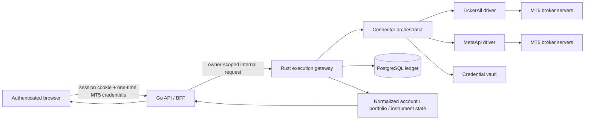

# Universal MT5 Cloud Connector: implementation plan

- Status: Plan 0 contract review complete; live validation blocked and the
  production gate has not passed
- Planning baseline: 11 August 2026
- First implementation unit: Plan 0 - provider and broker validation
- Primary candidate: TickerAll (`CONDITIONAL_STOP` pending missing contract
  surfaces and written answers)
- Fallback candidate: MetaApi (proceed to live validation when secrets and
  disposable demos are available)

This document is the authoritative implementation plan for connecting user-owned
MetaTrader 5 accounts to MarketLens without requiring the user to install or
open MT5 Desktop, MT5 Mobile, MT5 WebTerminal, an Expert Advisor, or a local
connector.

The user signs in to MarketLens with the existing application authentication,
opens **Connect MT5 account**, and submits the MT5 login, trading password, and
exact broker server over HTTPS. The backend owns the provider connection and
keeps account state synchronized with the existing execution platform.

Do not start a later plan until every exit gate in the preceding plan passes.
Do not advertise support for a broker until that broker/server combination has
passed the certification matrix in Plan 7.

The current Plan 0 evidence, blocker list, provider matrix, test inventory, and
secret-safe resume runbook are maintained in
`MT5_CLOUD_CONNECTOR_PHASE0_VALIDATION.md`. Do not interpret a documentation-
only capability as a passed live test.

## 1. Product decision

### 1.1 Required user experience

```text
User opens MarketLens
    -> signs in with the existing Google/application login
    -> selects Connect MT5 account
    -> enters MT5 login + password + exact server
    -> waits for backend verification and initial synchronization
    -> trades from the MarketLens chart and Trade workspace
```

The user does not:

- install or launch an MT5 desktop application;
- open the broker's MT5 WebTerminal;
- install an EA, DLL, browser extension, or local connector;
- create a provider API key;
- select TickerAll or MetaApi;
- expose a provider account identifier to the browser.

Application login and broker connection are separate operations. Google login
identifies the MarketLens owner. MT5 credentials authorize a broker session for
one account owned by that user. MT5 has no public retail OAuth flow, so the
broker connection dialog resembles an OAuth connection only at the user-
experience level; it is not an OAuth redirect or consent-token exchange.

### 1.2 Universal broker boundary

The implementation must use one common code path for FTMO, Exness, IC Markets,
Pepperstone, and other compatible MT5 brokers. No execution, risk, Go handler,
or React branch may use a broker or prop-firm name to decide behavior.

Broker differences are represented only by discovered account capabilities,
instrument specifications, exact server identity, symbol mappings, and an
operational compatibility registry. Prop-firm loss rules remain in the
separate versioned Prop Risk Guard and never enter the connector driver.

### 1.3 Production completion boundary

The connector is production-ready only when it can:

1. connect an unrecognized but provider-supported MT5 server without a source
   change;
2. discover the authoritative account, portfolio, instrument, and trading
   capability state;
3. preserve the existing owner, trade-authorization, routing, risk,
   idempotency, audit, copier, and reconciliation boundaries;
4. recover from process, network, provider, and broker disconnects without
   creating a duplicate trade;
5. distinguish a stale/unknown portfolio from an empty portfolio;
6. keep provider credentials and broker passwords out of the browser after
   submission, logs, metrics, PostgreSQL plaintext, and API responses;
7. pass the broker certification and canary gates in Plans 7 and 8.

## 2. Current repository baseline

The existing production execution architecture remains the foundation:

- The Go API/BFF authenticates the browser, derives the owner from the server
  session, applies rate limits, and injects owner identity into loopback Rust
  calls.
- The Rust execution gateway owns deterministic routing, prop-risk checks,
  trade-authorization consumption, per-target idempotency, durable commands,
  event persistence, copy orchestration, and reconciliation.
- PostgreSQL owns the durable account, command, event, audit, copier, and risk
  state.
- `VenueAdapter` already defines the broker-neutral transport boundary.
- `execution_accounts.secret_ref` exists, while migration `0026` explicitly
  forbids raw broker/API credentials in the execution registry.
- Frontend account and order models are broker-neutral.

The existing EA transport remains supported during migration. A cloud account
and an EA account are both `metatrader5` venues; they differ by connector kind,
not by risk or order semantics. The cloud connector is additive and must not
silently change or remove existing EA accounts.

## 3. Target architecture



### 3.1 Runtime ownership

| Boundary | Authority |
| --- | --- |
| Browser | Collect connection input, display state, submit user intent |
| Go BFF | Authentication, owner injection, input bounds, CSRF/origin policy, public rate limits |
| Rust gateway | Connector lifecycle, routing, risk, durable commands, reconciliation, audit |
| Provider driver | Translate common commands/state to one provider protocol |
| PostgreSQL | Durable non-secret state, leases, cursors, commands, outcomes, audit |
| Credential vault | Optional encrypted persistent MT5 credential material |
| TickerAll/MetaApi | Maintain the provider-side connection to the broker |

The browser never receives the provider API key. The provider never decides
the MarketLens owner, copy allocation, prop-risk policy, symbol policy, or
whether a trade authorization is valid.

## 4. Terminology

| Term | Meaning |
| --- | --- |
| Broker account | The user's MT5 login on one exact server |
| Connector provider | TickerAll, MetaApi, or a future cloud MT5 service |
| Provider account reference | Provider-specific opaque identifier stored server-side |
| Connector kind | `ea` for the existing terminal transport or `cloud` for this plan |
| Provider driver | Implementation of the common connector contract for one provider |
| Orchestrator | Selects a provider, owns lifecycle state, leases and fail-closed policy |
| Session connection | Broker password is not retained by MarketLens; reconnect may require input |
| Managed connection | Credential material is stored through a vault reference for unattended recovery |
| Broker certification | Evidence that a specific server family passes the required lifecycle matrix |
| Outcome unknown | A request may have reached the broker but no authoritative result is available |

## 5. Non-negotiable invariants

1. **One broker-neutral execution path.** Provider and broker names never fork
   routing, risk, copier, authorization, or frontend order construction.
2. **Persist before submit.** Every mutating broker command is durable before a
   provider request is sent.
3. **No blind retry after an ambiguous submit.** Timeout after transmission
   becomes `unknown`; reconciliation must prove absence or discover the broker
   resource before any retry.
4. **Owner isolation.** Every local account, provider binding, credential
   reference, command, cursor, lease, and event is scoped to the authenticated
   owner.
5. **Provider identifiers are untrusted.** They never replace local composite
   owner/account authorization.
6. **No plaintext credentials at rest.** MT5 passwords never enter ordinary
   PostgreSQL columns, structured logs, traces, analytics, crash reports, or
   browser storage.
7. **Freshness is explicit.** `ready` requires fresh account, portfolio, and
   instrument evidence plus a healthy command transport.
8. **Empty is not unknown.** A stale or incomplete provider snapshot cannot
   erase an existing position projection.
9. **Capabilities are discovered per account.** Volume, stop distance,
   hedging/netting, filling, symbol and lifecycle behavior are never inferred
   from a broker name.
10. **Provider fallback is controlled.** Automatic fallback is permitted
    during initial connection for an unsupported server. It is forbidden for
    an in-flight or ambiguous trading command.
11. **Live remains fail-closed.** Demo and Live share code, but a Live account
    is not enabled until the same security and certification gates pass.
12. **The EA path remains recoverable.** Cloud rollout must have a feature flag
    and cannot invalidate existing EA sessions or open broker positions.

## 6. Common connector contract

Create a new workspace crate rather than adding provider HTTP calls directly to
`execution-gateway/src/main.rs`:

```text
backend/execution/crates/execution-connectors/
  Cargo.toml
  src/
    lib.rs
    contract.rs
    models.rs
    errors.rs
    orchestrator.rs
    registry.rs
    secrets.rs
    tickerall/
      mod.rs
      client.rs
      mapper.rs
      stream.rs
    metaapi/
      mod.rs
      client.rs
      mapper.rs
      stream.rs
```

The initial contract should cover control plane, data plane, and execution:

```rust
#[async_trait]
pub trait BrokerConnector: Send + Sync {
    fn provider(&self) -> ConnectorProvider;
    fn platform(&self) -> TradingPlatform;

    async fn connect(
        &self,
        request: ConnectBrokerAccount,
    ) -> Result<ConnectedBrokerAccount, ConnectorError>;

    async fn inspect(
        &self,
        reference: &ProviderAccountRef,
    ) -> Result<ConnectionInspection, ConnectorError>;

    async fn disconnect(
        &self,
        reference: &ProviderAccountRef,
    ) -> Result<(), ConnectorError>;

    async fn remove(
        &self,
        reference: &ProviderAccountRef,
    ) -> Result<(), ConnectorError>;

    async fn snapshot(
        &self,
        reference: &ProviderAccountRef,
    ) -> Result<BrokerSnapshot, ConnectorError>;

    async fn instruments(
        &self,
        reference: &ProviderAccountRef,
    ) -> Result<Vec<BrokerInstrument>, ConnectorError>;

    async fn submit(
        &self,
        reference: &ProviderAccountRef,
        command: ProviderCommand,
    ) -> Result<ProviderReceipt, ConnectorError>;

    async fn reconcile(
        &self,
        reference: &ProviderAccountRef,
        probe: ReconciliationProbe,
    ) -> Result<ReconciliationEvidence, ConnectorError>;
}
```

Provider-native payloads must stop inside `tickerall` or `metaapi`. The rest of
the repository consumes normalized decimal strings, timestamps in UTC, broker
tickets as strings, and existing execution-domain enums.

## 7. Normalized connection state machine

```text
unconfigured
    -> connecting
    -> authenticating
    -> synchronizing
    -> ready

ready
    -> degraded
    -> reconnecting
    -> ready

connecting/authenticating
    -> credentials_required
    -> unsupported
    -> blocked

any non-removed state
    -> disconnected
    -> removed
```

`ready` requires all of the following:

- the provider reports an authenticated broker connection;
- account login and server match the connection request;
- account snapshot is within the configured freshness threshold;
- portfolio synchronization is complete;
- instrument metadata exists for tradable symbols;
- the account mode and `tradeAllowed` state are known;
- the current worker owns the connector lease;
- the provider command transport is healthy.

`credentials_required` is a first-class state. It is not converted to
`offline` because the UI must tell the user that re-entry is required.

## 8. Provider selection policy

The frontend submits `platform`, `login`, `password`, and `server`; it does not
submit a provider. The orchestrator chooses from server-owned configuration:

```yaml
cloudMt5:
  enabled: false
  providers:
    - tickerall
    - metaapi
  defaultProvider: tickerall
  allowInitialFallback: true
```

Selection rules:

1. Use a verified provider override for the normalized server if present.
2. Otherwise use the configured provider priority.
3. Fall back only on a classified `SERVER_UNSUPPORTED` or
   `PROVIDER_CAPABILITY_UNAVAILABLE` result.
4. Stop immediately on invalid credentials, account lock, rate limiting,
   compliance denial, or an ambiguous provider response.
5. Record which providers were attempted without recording credentials.
6. Pin the successful provider to the account binding.
7. Never migrate a connected account with non-terminal commands without an
   explicit operator workflow and completed reconciliation.
8. Disclose the enabled connector providers as security/privacy subprocessors
   even though normal users do not make a routing choice in the connection UI.

## 9. Credential policy

### 9.1 Browser handling

- Use a controlled password input in a dedicated connection dialog.
- Submit only to the authenticated same-origin Go API over HTTPS.
- Never put the password in a query string, URL, browser log, Redux/Jotai
  persisted atom, LocalStorage, sessionStorage, IndexedDB, analytics event, or
  error-reporting context.
- Clear the input and component state immediately after the request settles.
- Disable automatic mutation retries for the connection request.
- Do not echo the password or provider request body in validation errors.

### 9.2 Backend handling

Support two explicit persistence modes:

| Mode | Behavior |
| --- | --- |
| `session` | Forward password to the provider, keep no MarketLens credential secret, require re-entry when the provider cannot restore the connection |
| `managed` | Store credential material only through `BrokerCredentialVault`; PostgreSQL stores an opaque `secret_ref` |

The MVP begins with `session`. `managed` cannot be enabled in production until
the selected vault supports authenticated encryption, key versioning,
rotation, deletion, access audit, least-privilege service identity, and a
documented incident-revocation procedure.

Provider API keys are deployment secrets and are never stored per account.
Provider API responses and errors must be passed through an explicit redactor
before logging.

## 10. Proposed public API

All paths are below `/api/v1` and use the existing authenticated session.

### 10.1 Connect

```http
POST /execution/connectors/mt5/accounts
```

```json
{
  "platform": "mt5",
  "login": "12345678",
  "password": "broker-trading-password",
  "server": "Broker-MT5-Live01",
  "label": "Primary MT5",
  "persistence": "session"
}
```

The initial production input accepts MT5 only. Keeping `platform` explicit
allows a future MT4 driver without changing the contract.

The browser cannot submit a WebTerminal URL, provider endpoint, provider name,
region, or terminal-emulation type. Those values come from provider discovery
or the server-owned compatibility registry. This prevents an account-connect
request from becoming an SSRF or arbitrary upstream-routing primitive.

Successful asynchronous response:

```json
{
  "accountId": "mt5c_01k...",
  "status": "connecting",
  "connectionRevision": 1
}
```

The response must not contain a provider account reference, provider token,
credential reference, or raw upstream response.

### 10.2 Inspect connection

```http
GET /execution/connectors/accounts/:accountId
```

```json
{
  "accountId": "mt5c_01k...",
  "platform": "mt5",
  "brokerCode": "broker-company",
  "server": "Broker-MT5-Live01",
  "mode": "demo",
  "status": "ready",
  "tradeAllowed": true,
  "persistence": "session",
  "credentialsRequired": false,
  "lastAccountSyncAt": 1786464000000,
  "lastPortfolioSyncAt": 1786464000000
}
```

### 10.3 Reconnect credentials

```http
POST /execution/connectors/accounts/:accountId/reconnect
```

Requires password and an expected `connectionRevision`. It cannot change the
login/server identity of an existing account.

### 10.4 Existing account routes

Continue using the current routes for account list/state/instruments, orders,
lifecycle commands, disconnect, and remove. Their implementation dispatches by
connector kind while preserving the same browser DTOs.

## 11. Proposed database change

Use additive migration `0038_execution_cloud_connectors` unless another
migration is allocated first.

Add the transport discriminator to the existing account authority. Existing
rows are backfilled as `ea`, so the current production behavior remains the
default:

```sql
ALTER TABLE execution_accounts
  ADD COLUMN connector_kind text NOT NULL DEFAULT 'ea'
  CHECK (connector_kind IN ('ea', 'cloud'));
```

The provider binding table contains cloud accounts only. The existing
`execution_accounts.secret_ref` column remains the sole opaque vault reference;
do not add a second credential-reference column.

```sql
CREATE TABLE execution_connector_accounts (
  user_id                  uuid NOT NULL,
  account_id               text NOT NULL,
  provider                 text NOT NULL CHECK (provider IN ('tickerall', 'metaapi')),
  provider_account_ref     text NOT NULL,
  terminal_type            text NOT NULL CHECK (terminal_type IN ('web', 'mobile', 'cloud_terminal')),
  persistence_mode         text NOT NULL CHECK (persistence_mode IN ('session', 'managed')),
  connection_status        text NOT NULL,
  connection_revision      bigint NOT NULL DEFAULT 1,
  provider_region          text,
  last_account_sync_at     timestamptz,
  last_portfolio_sync_at   timestamptz,
  last_instrument_sync_at  timestamptz,
  last_event_cursor        text,
  last_sequence_number     bigint,
  last_error_code          text,
  last_error_message       text,
  created_at               timestamptz NOT NULL DEFAULT now(),
  updated_at               timestamptz NOT NULL DEFAULT now(),
  PRIMARY KEY (user_id, account_id),
  FOREIGN KEY (user_id, account_id)
    REFERENCES execution_accounts(user_id, id) ON DELETE CASCADE
);
```

Add a lease table so only one replica owns a provider account stream and
command dispatcher:

```sql
CREATE TABLE execution_connector_leases (
  user_id          uuid NOT NULL,
  account_id       text NOT NULL,
  lease_owner      uuid NOT NULL,
  lease_generation bigint NOT NULL,
  lease_expires_at timestamptz NOT NULL,
  updated_at       timestamptz NOT NULL DEFAULT now(),
  PRIMARY KEY (user_id, account_id),
  FOREIGN KEY (user_id, account_id)
    REFERENCES execution_connector_accounts(user_id, account_id)
      ON DELETE CASCADE
);
```

Add a compatibility registry only for operational evidence; it is not an
execution rules table:

```sql
CREATE TABLE execution_broker_server_certifications (
  platform             text NOT NULL,
  normalized_server    text NOT NULL,
  company_name         text NOT NULL DEFAULT '',
  preferred_provider   text,
  certification_status text NOT NULL,
  capability_evidence  jsonb NOT NULL DEFAULT '{}'::jsonb,
  verified_at          timestamptz,
  notes                text NOT NULL DEFAULT '',
  PRIMARY KEY (platform, normalized_server)
);
```

Provider event IDs continue to use `execution_events.external_event_id`.
Provider state must not create a parallel command or audit ledger.

Detailed connector states map to the existing account status contract:

| Connector state | `execution_accounts.status` |
| --- | --- |
| `connecting`, `authenticating`, `synchronizing`, `reconnecting` | `connecting` |
| `ready` | `ready` |
| `degraded` | `degraded` |
| `credentials_required`, `unsupported` | `blocked` with a normalized status reason |
| `disconnected` | `offline` |
| administratively disabled | `disabled` |

This preserves current Go/frontend enums while the connector inspection route
provides the more precise connection lifecycle.

## 12. Account and symbol normalization

Local account identity remains stable across process restarts and provider
references. Derive it from the authenticated owner plus normalized platform,
server, and login. Do not derive it from a mutable broker display name.

Each initial synchronization must discover:

- authoritative login and exact server;
- company/broker display name;
- Demo/Live/Unknown mode;
- currency, balance, equity and trade permission;
- hedging or netting mode;
- native symbols and visibility;
- minimum, maximum and step quantity;
- contract size, tick size and tick value;
- stop and freeze distances;
- filling/execution modes and market sessions;
- pending-order, partial-close and modification capabilities.

Canonical symbol mapping is resolved against per-account native instruments.
Suffixes such as `EURUSDm`, `EURUSD.a`, or `EURUSD.` are data, not code
branches. Existing user mappings remain authoritative when discovery is
ambiguous.

## 13. Data synchronization contract

### 13.1 Initial synchronization

1. Establish the provider connection.
2. Verify login/server identity.
3. Fetch account snapshot.
4. Fetch a complete position and pending-order snapshot.
5. Fetch instrument specifications.
6. Persist snapshots transactionally through the existing account/event
   projection path.
7. Open the provider realtime subscription.
8. Reconcile events received during the snapshot window.
9. Publish `ready` only after a final complete snapshot or provider-supported
   synchronization barrier.

### 13.2 Realtime synchronization

- One TickerAll WebSocket may carry several provider account IDs, but every
  incoming event must resolve through the owner-scoped binding before use.
- MetaApi sequence and synchronization events must map to the same normalized
  cursor/gap contract.
- Duplicate provider events are accepted idempotently.
- A cursor or sequence gap immediately degrades the account and triggers a full
  snapshot reconciliation.
- Realtime events update projections only when their connection revision and
  lease generation are current.

### 13.3 Poll fallback

Realtime is not the only source of correctness. Perform periodic complete
account/portfolio reconciliation and compare normalized hashes. Polling must
use bounded jitter, provider rate-limit budgets, and per-account backoff.

## 14. Execution and outcome reconciliation

The current order pipeline remains authoritative:

```text
browser intent
  -> Go authentication and owner injection
  -> Rust trade-authorization consumption
  -> route and prop-risk checks
  -> durable parent and target command
  -> connector dispatcher lease
  -> provider submit
  -> broker acknowledgement/event
  -> durable outcome and portfolio reconciliation
```

Dispatch rule:

```text
venueKind = metatrader5
  + connectorKind = ea     -> existing EA command queue
  + connectorKind = cloud  -> BrokerConnector submit
```

Provider mappings must cover:

- market buy/sell;
- limit and stop pending orders;
- modify position SL/TP;
- modify pending entry/SL/TP where supported;
- full and partial close;
- cancel pending order;
- sync/reconciliation probe.

TickerAll's mutation idempotency key must use the existing target-command
idempotency identity. MetaApi requests must carry the stable MarketLens
client/request identity where supported, but the local ledger remains the
authority.

### 14.1 Ambiguous outcome algorithm

When a provider request times out after transmission:

1. mark the target command `unknown` with the provider request identity;
2. stop automatic submission retry;
3. query provider account state and trade history;
4. search for broker ticket, provider request ID, client ID, comment marker,
   and expected normalized portfolio delta;
5. adopt a discovered resource and complete the command;
6. keep the command unknown and block related risk-increasing work when
   evidence conflicts or remains incomplete;
7. expose an operator/user-safe reconciliation status without offering a
   one-click resend.

Risk-reducing close/cancel work may use a separately proven current resource,
but it must not overwrite the unknown command's evidence.

## 15. Normalized errors

Provider errors map to stable application codes:

```text
AUTH_INVALID
AUTH_TOTP_REQUIRED
SERVER_NOT_FOUND
SERVER_UNSUPPORTED
ACCOUNT_ALREADY_CONNECTED
ACCOUNT_READ_ONLY
ACCOUNT_DISABLED
CREDENTIALS_REQUIRED
PROVIDER_RATE_LIMITED
PROVIDER_UNAVAILABLE
BROKER_TIMEOUT
BROKER_REJECTED
MARKET_CLOSED
SYMBOL_NOT_FOUND
INVALID_VOLUME
INVALID_STOPS
INSUFFICIENT_MARGIN
PRICE_CHANGED
TRANSPORT_STALE
OUTCOME_UNKNOWN
```

Store the provider code and a bounded redacted diagnostic in audit metadata.
Browser messages use the normalized code and never reveal provider keys,
password fragments, infrastructure hosts, or another tenant's identifiers.

## 16. Frontend design

Add a universal connection dialog rather than provider-specific screens:

```text
Connect MT5 account

Platform       MetaTrader 5
Server         [Search or enter exact server]
Login          [12345678]
Password       [************]
Connection     [This session | Keep connected securely]

               [Cancel] [Connect account]
```

Frontend states:

```text
Connecting
Authenticating
Synchronizing account
Ready
Read-only
Credentials required
Degraded
Disconnected
Unsupported server
```

The account management dialog must render connector-aware language:

- EA account: existing pairing/version/poll controls;
- cloud account: provider-neutral connection, freshness, reconnect and remove
  controls;
- never show a pairing token for cloud accounts;
- never display the provider API key or raw provider account reference.

The existing account rail, Trade workspace, position/order tables, copy
routing, lifecycle commands and prop-risk UI consume the same normalized
account IDs and snapshots.

## 17. Observability and operations

Required metrics:

- connected accounts by provider and normalized status;
- connect latency and failure classification;
- account/portfolio/instrument snapshot age;
- WebSocket reconnects, cursor gaps and full reconciliations;
- provider REST/stream rate-limit budget;
- command submit latency and broker acknowledgement latency;
- unknown outcomes and reconciliation duration;
- lease ownership changes and stale-worker event rejections;
- credential-required transitions;
- provider/broker certification pass rate.

Required structured log fields:

```text
owner_hash
account_id
connector_provider
connection_revision
lease_generation
command_id
provider_request_id_hash
normalized_error_code
```

Never log `password`, provider API keys, vault values, complete MT5 login where
not operationally required, Authorization headers, WebSocket tokens, or raw
upstream request bodies.

Production health must distinguish:

- execution gateway process health;
- provider control-plane reachability;
- provider stream health;
- per-account broker synchronization freshness.

Global provider degradation must not make the process health endpoint fail in
a restart loop. It must make affected accounts fail closed and alert operators.

## 18. Feature flags and rollback

```dotenv
EXECUTION_CLOUD_MT5_ENABLED=false
EXECUTION_CLOUD_MT5_CONNECT_ENABLED=false
EXECUTION_CLOUD_MT5_TRADE_ENABLED=false
EXECUTION_CLOUD_MT5_PROVIDER=tickerall
EXECUTION_CLOUD_MT5_ALLOW_INITIAL_FALLBACK=false
```

Rollback order:

1. disable new cloud connections;
2. disable cloud risk-increasing commands;
3. allow synchronized risk-reducing commands only if the provider path remains
   proven healthy;
4. preserve account bindings, command evidence, provider references and broker
   positions;
5. never remove or close broker resources merely because the feature is
   disabled;
6. allow users to manage remaining positions at their broker while MarketLens
   shows an explicit degraded/offline state.

## 19. Implementation plans

### Plan 0 - Provider and broker validation

**Current execution status (11 August 2026):** contract review is complete but
the exit gate is blocked. TickerAll is a conditional no-go because its public
contract does not document pending-order read/modify/cancel, complete instrument
specifications, or replayable stream ordering. MetaApi is the fallback selected
for live validation. No provider token or three-account disposable demo set is
available in the workspace, so no `LIVE` evidence exists yet. See
`MT5_CLOUD_CONNECTOR_PHASE0_VALIDATION.md` and its sanitized fixture directory.

**Objective:** prove the external path before changing production contracts.

**Dependencies:** TickerAll development API key; MT5 demo credentials for at
least one prop-firm server and two retail broker server families.

**Work:**

- Build a disposable, non-repository spike or test harness that calls the
  provider directly.
- Verify login/server discovery and wrong-password classification.
- Verify Demo/Live detection and investor-password read-only behavior.
- Capture account, portfolio, symbols and instrument specifications.
- Exercise market, pending, modify, cancel, full close and partial close on
  demo accounts.
- Verify idempotency by replaying the same mutation identity.
- Force REST timeout, WebSocket reconnect and session cooling.
- Confirm whether each tested server requires `web`, `mobile`, or an explicit
  WebTerminal URL.
- Document provider retention, account ownership, deletion and support terms.
- Obtain written confirmation where a broker or prop firm requires approval
  for a third-party cloud connection.

**Artifacts:**

- Provider capability matrix.
- Redacted request/response fixtures for contract tests.
- Broker certification candidates with exact server names.
- Decision record confirming TickerAll proceed/stop and MetaApi fallback need.

**Tests:** demo-only; no production account and no repository execution path.

**Exit gate:** at least three distinct MT5 server families pass read sync, two
pass the complete demo trading lifecycle, idempotency is observed, and no
unclassified ambiguous behavior remains.

**Rollback:** revoke the test API key and remove provider-side test accounts.

**Commit boundary:** documentation and sanitized fixtures only.

### Plan 1 - Common domain, schema and feature flags

**Objective:** introduce the provider-neutral connector boundary with all
runtime flags disabled.

**Primary files:**

- `backend/execution/Cargo.toml`
- `backend/execution/crates/execution-connectors/**`
- `backend/execution/crates/execution-domain/src/lib.rs`
- `backend/execution/crates/execution-gateway/src/main.rs`
- `backend/migrations/0038_execution_cloud_connectors.*.sql`
- `backend/internal/config/**`
- `backend/docs/CONFIGURATION.md`
- `backend/docs/DATABASE.md`

**Work:**

- Add connector enums, normalized models, errors and state machine.
- Add `BrokerConnector` and `BrokerCredentialVault` traits.
- Add connector account, lease and certification tables.
- Add owner-scoped repository methods and optimistic connection revision.
- Add disabled-by-default configuration and startup validation.
- Preserve the existing `VenueKind::MetaTrader5`; add connector kind instead
  of a new venue per provider.
- Add a fake connector for deterministic tests.

**Tests:** migration up/down, owner isolation, unique account identity,
revision conflict, lease fencing, serialization and secret redaction.

**Exit gate:** all Go/Rust tests pass; production behavior is unchanged when
flags are absent; no provider dependency is required at startup.

**Rollback:** disable flags and roll back only the additive migration if no
connector binding exists.

**Suggested commit:** `Add broker-neutral cloud connector foundation`.

### Plan 2 - Secure connection API

**Objective:** connect and inspect an account without enabling trading.

**Primary files:**

- `backend/internal/execution/handler.go`
- `backend/internal/execution/client.go`
- `backend/internal/execution/model.go`
- `backend/internal/httpserver/server.go`
- `backend/execution/crates/execution-gateway/src/main.rs`
- `frontend/src/services/api/resources/executionApi.ts`

**Work:**

- Add Go public connect/inspect/reconnect handlers.
- Add Rust loopback admin endpoints with injected owner identity.
- Enforce strict login/server/label/password bounds and request body limits.
- Add a connection-specific rate limiter and no-store responses.
- Add request/log redaction tests before accepting a password field.
- Forward credentials directly to the selected driver and clear temporary
  values as soon as practical.
- Implement session persistence first; keep managed persistence disabled until
  a production vault adapter passes review.
- Reject client-supplied provider references and owner IDs.

**Tests:** cross-owner access, invalid input, wrong password, unsupported
server, duplicate account, response redaction, retry disabled, provider timeout
and cancellation.

**Exit gate:** authenticated users can connect and inspect a fake/demo account;
the frontend and API never retain or echo the password; trading flags remain
off.

**Rollback:** disable connect flag; existing EA account routes remain intact.

**Suggested commit:** `Add secure MT5 cloud account connection API`.

### Plan 3 - TickerAll control-plane driver

**Objective:** connect real demo broker accounts through the first provider.

**Primary files:** `execution-connectors/src/tickerall/**` plus configuration
and contract fixtures.

**Work:**

- Implement bounded REST client, authentication, timeouts and redaction.
- Create/inspect/disconnect/remove provider sessions.
- Map provider status and errors to normalized values.
- Pin provider account reference to an owner-scoped local binding.
- Handle session cooling and `credentials_required` explicitly.
- Add circuit breaker, exponential backoff and rate-limit handling.
- Do not enable provider fallback during this plan.

**Tests:** recorded fixture contract tests, fake HTTP server, malformed payload,
oversized response, duplicate connect, rate limit, timeout and provider
unavailability.

**Exit gate:** Plan 0 demo servers connect through the production Rust/Go path
and appear in `GET /execution/accounts`; orders remain disabled.

**Rollback:** disable TickerAll/connect flags and remove provider-side demo
sessions without deleting local audit evidence.

**Suggested commit:** `Connect MT5 demo accounts through TickerAll`.

### Plan 4 - Account, portfolio and instrument synchronization

**Objective:** make cloud accounts authoritative read-only execution accounts.

**Primary files:**

- `execution-connectors/src/tickerall/stream.rs`
- `execution-connectors/src/tickerall/mapper.rs`
- execution gateway persistence and account-state code
- frontend execution registry and account status presentation

**Work:**

- Add provider WebSocket manager and owner-scoped subscription registry.
- Implement initial synchronization barrier and complete snapshot ingestion.
- Map account, positions, pending orders and instruments into current domain
  projections.
- Add cursor/sequence dedupe, gap detection and lease fencing.
- Add periodic complete reconciliation with normalized hashes.
- Add freshness-derived ready/degraded/credentials-required states.
- Preserve last authoritative portfolio during incomplete/stale sync.
- Reuse current symbol mapping and Prop Risk Guard input paths.

**Tests:** duplicate/out-of-order events, cursor gap, reconnect during snapshot,
stale worker, backend restart, provider stream loss, empty versus unknown
portfolio, symbol suffix and hedging/netting fixtures.

**Exit gate:** account rail, positions, pending orders, equity, instruments and
risk state remain correct through repeated disconnect/reconnect tests for all
Plan 0 servers; cloud trading is still disabled.

**Rollback:** disable cloud sync publication and show accounts degraded without
erasing their last authoritative portfolio.

**Suggested commit:** `Synchronize cloud MT5 account state`.

### Plan 5 - Durable cloud execution and reconciliation

**Objective:** enable demo trading through the existing command ledger.

**Primary files:**

- `execution-connectors` provider command mapping
- `execution-adapters/src/lib.rs`
- execution gateway enqueue/lease/outcome paths
- existing Go order/command routes

**Work:**

- Dispatch MT5 commands by connector kind.
- Map all supported place/modify/close/cancel operations.
- Reuse target-command idempotency for provider mutation keys.
- Persist provider request ID and broker tickets.
- Implement ambiguous-outcome reconciliation before retry.
- Feed provider outcomes and portfolio evidence into the existing copier link,
  command outcome and audit paths.
- Reject operations absent from discovered account capabilities.
- Keep cloud risk-increasing execution behind a separate demo-only flag.

**Tests:** duplicate mutation, timeout before send, timeout after send,
acknowledgement loss, partial fill/close, pending fill, close/cancel races,
market closed, invalid stops/volume, margin rejection, provider restart and two
gateway replicas.

**Exit gate:** the complete demo lifecycle passes without duplicate broker
resources; every request has a durable terminal outcome or explicit unknown
reconciliation state.

**Rollback:** disable cloud trade flag; keep synchronization active so users
can see and manage broker exposure elsewhere.

**Suggested commit:** `Route durable MT5 commands through cloud connectors`.

### Plan 6 - Universal frontend connection experience

**Objective:** deliver the no-install/no-MT5-open browser flow.

**Primary files:**

- `frontend/src/types/execution.ts`
- `frontend/src/services/api/resources/executionApi.ts`
- `frontend/src/components/trade/ExecutionAccountManagementDialog.tsx`
- new `ConnectMt5CloudAccountDialog.tsx`
- execution registry/store tests and localization catalogs

**Work:**

- Add universal Connect MT5 dialog with server/login/password fields.
- Make provider selection invisible to normal users.
- Clear password state after submission and prohibit persisted storage.
- Add connecting/authenticating/synchronizing/read-only/credentials-required/
  degraded/unsupported states.
- Separate EA management controls from cloud management controls.
- Add reconnect and remove confirmation flows.
- Keep existing Trade, chart order, position, pending-order, copier and risk UI
  unchanged after account readiness.
- Add responsive mobile behavior, keyboard navigation and accessible errors.

**Tests:** component/AST checks for password persistence, mocked API lifecycle,
cancel/retry, account isolation, logout reset, mobile layout, accessibility and
provider-neutral copy.

**Exit gate:** a new user can connect a Plan 0 demo account and trade from the
web without opening any MT5 product; browser storage and network inspection
show no retained password or provider key.

**Rollback:** hide Connect MT5 Cloud behind its flag; existing accounts stay
visible and EA onboarding remains available.

**Suggested commit:** `Add universal web-only MT5 connection flow`.

### Plan 7 - Multi-broker certification

**Objective:** prove common-code behavior across broker families.

**Required matrix:**

| Dimension | Minimum evidence |
| --- | --- |
| Prop-firm demo | One FTMO-class server or approved equivalent |
| Retail demo | Two unrelated broker companies |
| Symbol naming | Exact symbol plus at least two suffix/prefix variants |
| Accounting | One hedging and one netting account |
| Order lifecycle | Market, limit, stop, modify, cancel, full/partial close |
| Failure | Wrong credentials, market closed, rate limit, stream loss, timeout |
| Recovery | Provider reconnect, backend restart, lease takeover, reconciliation |

Certification statuses:

```text
unverified
testing
verified_read
verified_demo_trade
verified_live_trade
degraded
unsupported
```

**Work:**

- Build an automated provider contract/certification harness.
- Store bounded capability evidence per exact server.
- Publish only honest UI support status; unverified servers may be attempted
  but are not advertised as supported.
- Verify broker terms and account-sharing restrictions separately from
  technical capability.
- Run sustained demo sessions for at least five trading days.

**Exit gate:** at least three broker families are `verified_demo_trade`, all
matrix failures are normalized, and no broker-specific source branch was
introduced.

**Rollback:** downgrade the affected server certification and block new
risk-increasing commands while preserving read synchronization.

**Suggested commit:** `Add multi-broker MT5 certification harness`.

### Plan 8 - MetaApi secondary provider

**Objective:** add provider redundancy without changing product contracts.

**Work:**

- Implement MetaApi provisioning/deploy lifecycle behind `BrokerConnector`.
- Map synchronization sequence, account, position, order, history and trade
  responses to the common domain.
- Implement provider-specific ambiguous-outcome evidence without weakening the
  local no-blind-retry rule.
- Certify the same broker matrix where MetaApi is intended as fallback.
- Enable initial-connect fallback only for classified unsupported capability.
- Add an operator-only, fully reconciled migration runbook; do not implement
  automatic in-flight provider switching.

**Tests:** run the same contract suite used for TickerAll plus provisioning,
deploy, synchronization and token-expiry cases.

**Exit gate:** the frontend, Go routes, execution engine and risk system pass
unchanged tests while the same demo account can be connected through either
provider in isolated test runs.

**Rollback:** disable MetaApi and preserve the last pinned provider binding;
do not silently reconnect it through TickerAll.

**Suggested commit:** `Add MetaApi as a secondary MT5 connector`.

### Plan 9 - Production canary and managed credentials

**Objective:** enable unattended production connections under explicit user
consent.

**Work:**

- Select and implement the production credential vault adapter.
- Add managed/session persistence choice and reauthentication flow.
- Add credential rotation, deletion, access audit and incident revocation.
- Run security review for logs, traces, backups, support tooling and provider
  dashboard access.
- Deploy read-only canary accounts, then demo-trade canaries, then explicitly
  approved Live canaries.
- Add provider budget/limit alerts and per-account kill switches.
- Drill connector disable, provider outage, unknown outcome, credential revoke
  and database restore procedures.

**Exit gate:** security sign-off, broker/provider approval where applicable,
successful rollback drill, zero unresolved canary outcomes, and operator
runbook acceptance.

**Rollback:** revoke vault access, disable new/risk-increasing connections and
preserve synchronized broker state for manual management.

**Suggested commit:** `Harden cloud MT5 connectors for production rollout`.

## 20. Verification commands by plan

Run the smallest relevant suite during development and the full gates before
each plan's final commit.

```powershell
go test ./internal/execution ./internal/config ./internal/httpserver ./cmd/api
```

```powershell
cargo test --manifest-path execution/Cargo.toml --workspace --all-targets
```

```powershell
npm run typecheck
```

Add focused connector contract, security-boundary and frontend tests as the
plans introduce them. Production deployment continues to use only the
canonical repository-root command documented in `AGENTS.md` and
`backend/docs/PRODUCTION_BUILD.md`.

## 21. Definition of done for the whole initiative

- [ ] Users connect MT5 accounts entirely from MarketLens web.
- [ ] No user installation, MT5 application, MT5 WebTerminal, EA or local
  connector is required.
- [ ] Frontend never selects or authenticates directly to a connector provider.
- [ ] One common codebase supports all certified broker servers.
- [ ] New compatible servers require configuration/certification, not source
  branches.
- [ ] Credentials follow the session/managed policy and are absent from
  plaintext storage and telemetry.
- [ ] Account, portfolio and instruments recover through gaps and restarts.
- [ ] Commands remain durable and idempotent with explicit unknown outcomes.
- [ ] Existing route, risk, trade-password, copier and audit behavior remains
  authoritative.
- [ ] TickerAll and MetaApi pass the same common contract suite.
- [ ] Demo and approved Live canaries pass rollback and outage drills.

## 22. Starting point

Start with **Plan 0 only**. Do not create migration `0038`, public credential
routes, frontend password fields, or provider production secrets until the
external validation artifacts prove that the provider can support the common
account and lifecycle contract across multiple broker server families.

Relevant provider references:

- [TickerAll developer reference](https://tickerall.com/docs)
- [MetaApi client API](https://metaapi.cloud/docs/client/)
- [MetaApi account provisioning API](https://metaapi.cloud/docs/provisioning/)
