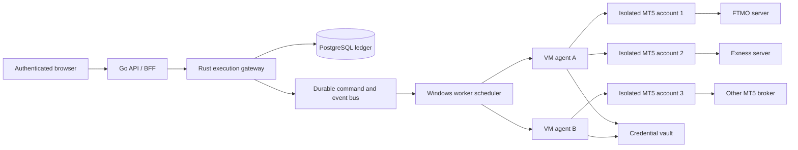

# Universal MT5 Windows VM connector plan

- Status: **approved architecture; Phase 0 complete; Phase 1 conditional; Phase 2 disposable operational gate PASS; Phase 3 Vault client PASS but API lifecycle gate open; Phase 4 repository gauntlet PASS but live broker gate open**
- Decision date: 12 August 2026
- Replaces the deleted TickerAll/MetaApi cloud-provider plan
- Runtime model: MarketLens-managed Windows VM pool, multiple terminals per VM
- VM worker implementation: Rust (`mt5-vm-agent`)
- MT5 integration: official MetaTrader 5 terminal plus the official Python package
- User-side requirement: browser only; no local MT5, EA, extension, or connector

This is the authoritative implementation plan for connecting user-owned MT5
accounts to MarketLens. A user signs in to MarketLens, enters the MT5 login,
master password, and exact server, and then trades from MarketLens web. The
MarketLens Windows worker pool owns every MT5 terminal process and keeps it
connected to the broker.

The design is broker-neutral. FTMO, Exness, and other MT5 brokers use the same
connector code. Broker-specific behavior is represented by discovered terminal
capabilities, symbol specifications, and a certification record, never by
broker-name branches in order or risk logic.

Do not start a later phase until the preceding exit gate passes. Demo and live
accounts share code, but live activation remains a separate production gate.

## 1. Product contract

### 1.1 User flow

```text
User signs in to MarketLens
  -> Connect broker
  -> select MT5
  -> enter MT5 login + master password + exact server
  -> choose session or managed reconnect mode
  -> wait for provisioning/authentication/synchronization
  -> trade from the MarketLens chart and Trade workspace
```

The user does not install or open MT5, an EA, a DLL, a browser extension, or a
local connector. MarketLens application authentication and MT5 authentication
remain separate: Google/application login identifies the MarketLens owner; MT5
credentials authorize one broker trading account.

### 1.2 What “no connector” means

There is no connector on the user's device. MarketLens still operates a private
Windows worker agent in its own infrastructure:

```text
Browser -> Go BFF -> Rust execution authority -> scheduler/event bus
        -> Windows VM agent -> isolated terminal64.exe -> broker MT5 server
```

The Windows agent is written in Rust. Python is retained only as a minimal,
per-terminal adapter because MetaQuotes distributes the supported retail
integration as the `MetaTrader5` Python package. Rust owns process supervision,
capacity, leases, network security, secrets, command dispatch, event ordering,
health, and recovery; Python owns no business rule or multi-account state.

The Windows agent and Python adapter are never exposed directly to the public
internet. Workers establish authenticated outbound control-plane connections or
accept traffic only on a private network with mutual authentication.

### 1.3 Completion boundary

The initiative is complete only when MarketLens can:

1. provision an isolated terminal instance for an arbitrary certified MT5
   server without a source change;
2. authenticate and prove that the resulting terminal account identity exactly
   matches the requested login and server;
3. synchronize account, positions, pending orders, deals, symbols, and trading
   specifications before reporting `ready`;
4. place, modify, cancel, partially close, and fully close demo orders through
   the existing durable execution/risk/idempotency path;
5. recover from terminal, agent, VM, network, and backend restarts without
   duplicating exposure or treating unknown state as empty;
6. keep MT5 passwords out of URLs, command lines, logs, metrics, ordinary
   PostgreSQL columns, browser storage, and committed fixtures;
7. isolate one account failure from every other account on the same VM;
8. pass the broker certification and live canary gates.

## 2. Existing repository baseline

The repository already provides useful foundations:

- `backend/bridge/mt5_stream/mt5_server.py` initializes a selected terminal,
  optionally authenticates with login/password/server, serializes MT5 calls on
  one worker thread, and exposes market data on loopback only.
- The Go MT5 stream service reconnects to the private Python sidecar and owns
  browser fan-out.
- The Rust execution gateway owns durable commands, account ownership,
  authorization, risk, idempotency, copy routing, and reconciliation.
- PostgreSQL already owns durable account/event/audit state and
  `execution_accounts.secret_ref` is the opaque credential reference.
- The production build can create `backend/.venv-mt5` and import-check
  `MetaTrader5` and `websockets`.

The current stream bridge is a single-terminal market-data process. It must not
be stretched into a multi-user process. The VM connector adds an agent and one
single-threaded Python adapter per isolated account terminal.

The legacy user-side EA connector remains a separate compatibility transport
until an explicit removal plan is approved. The Windows VM path is additive and
must not mutate existing EA account semantics.

## 3. Target architecture



### 3.1 Authority boundaries

| Component | Authority |
| --- | --- |
| Browser | Collect one-time connection input, display state, submit intent |
| Go BFF | User authentication, owner injection, CSRF/origin checks, public API limits |
| Rust gateway | Durable command authority, routing, risk, idempotency, reconciliation, audit |
| Scheduler | Worker placement, fencing generation, capacity and recovery decisions |
| Rust Windows agent | Multi-terminal lifecycle, supervision, capacity, and authenticated command/event transport |
| Python adapter | Single-threaded translation to the official `MetaTrader5` package |
| MT5 terminal | Authenticated broker session and native execution result |
| PostgreSQL | Durable non-secret state, leases, commands, outcomes and projections |
| Vault/KMS | Broker credential encryption, access audit, rotation and deletion |

Neither the worker nor MT5 decides MarketLens ownership, trade authorization,
prop-risk policy, copy allocation, or whether a durable command may be retried.

### 3.2 Multi-terminal VM runtime

```text
one Rust mt5-vm-agent process
  -> runtime account A -> terminal64.exe A + Python adapter A
  -> runtime account B -> terminal64.exe B + Python adapter B
  -> runtime account C -> terminal64.exe C + Python adapter C
```

Never switch concurrent user accounts through one terminal process. Terminal
directories, processes, logs, caches, IPC, health state, and leases are scoped
to one local account runtime. The Rust agent supervises all runtime pairs and
uses one ordered command lane per account. Agent/adapter IPC uses redirected
stdin/stdout framing or a private named pipe; it is not a public TCP service.

The target is multiple terminals per VM to reduce cost. The maximum is a
measured configuration value with a hard safety ceiling, not an unlimited
process count. Phase 0 defaults the Rust registry to four slots; Phase 6 replaces
that provisional value with per-VM-size benchmark evidence.

## 4. Non-negotiable invariants

1. **One broker-neutral order path.** Broker names cannot fork risk, routing,
   authorization, copier, or frontend order construction.
2. **One terminal per connected account.** Account switching is not a scaling
   mechanism.
3. **One MT5 caller thread per terminal.** The Python package is never called
   concurrently for the same terminal.
4. **Persist before submit.** A mutating command is durable before the agent is
   allowed to send it to MT5.
5. **No blind retry after transmission.** A lost response is `outcome_unknown`
   until reconciliation proves the broker result.
6. **Fenced ownership.** Every worker command carries account ID, lease
   generation, command ID, and expiry; a stale worker cannot execute it.
7. **Identity match before ready.** Requested and observed login/server must
   match exactly after normalization.
8. **Empty is not unknown.** A stale or failed snapshot cannot erase positions
   or pending orders.
9. **No plaintext credentials at rest.** PostgreSQL stores only `secret_ref`;
   VM disk and terminal directories use encrypted volumes and restrictive ACLs.
10. **No credential in process arguments.** Passwords are delivered through an
    authenticated in-memory channel and never a URL, CLI flag, startup INI, or
    ordinary environment variable.
11. **Workers are private.** No Python, terminal IPC, or agent port is public.
12. **Live is fail-closed.** A live account requires explicit feature policy,
    certification, risk guard, and canary approval.

## 5. Runtime state machines

### 5.1 Connection state

```text
unconfigured
  -> queued
  -> provisioning
  -> terminal_starting
  -> authenticating
  -> synchronizing
  -> ready

ready -> degraded -> reconnecting -> synchronizing -> ready
any active state -> credentials_required | unsupported | blocked | disconnected
disconnected -> removed
```

`ready` requires fresh account, portfolio, pending-order, and instrument
evidence; a healthy terminal/agent channel; an active fenced lease; and known
`trade_allowed`, demo/live mode, margin mode, and symbol constraints.

### 5.2 Command state

```text
accepted -> persisted -> dispatched -> received -> submitted
          -> broker_confirmed -> reconciled

submitted + lost response -> outcome_unknown -> reconciled
```

Only `accepted` commands with a valid trade authorization and risk decision may
be persisted. An expired or fenced command is rejected before `order_send`.

## 6. Common worker contract

The Windows agent contract is versioned and transport-neutral. Initial messages:

```text
AgentHello
AgentHeartbeat
ProvisionAccount
StopAccount
AccountRuntimeStatus
AccountSnapshot
InstrumentSnapshot
ExecuteCommand
CommandReceived
CommandResult
ReconcileAccount
RotateCredential
```

Every message includes `protocol_version`, `worker_id`, `account_id`,
`lease_generation`, `message_id`, and UTC timestamps. Mutations additionally
include the durable `command_id` and expected account revision.

The agent returns normalized data. MT5-native enums and object shapes stop
inside the Python adapter. Decimal trading values are serialized as strings;
broker tickets remain opaque strings.

## 7. Terminal lifecycle

### 7.1 Golden image

The worker image contains:

- patched Windows Server with a dedicated non-interactive service identity;
- a MetaQuotes-signed MT5 base installation;
- pinned 64-bit Python and locked dependencies;
- the signed Rust `mt5-vm-agent` and minimal per-terminal Python adapter;
- endpoint protection, encrypted disks, time synchronization, metrics and logs;
- no inbound public RDP; emergency access uses a controlled bastion/JIT policy.

Image creation records hashes and versions for Windows, terminal, Python,
packages, agent, and adapter. Production agents reject unapproved protocol or
binary versions.

### 7.2 Provision account

1. Scheduler acquires a durable lease and selects a compatible worker.
2. Agent creates an account runtime under a worker-managed data root.
3. Agent validates that the resolved path stays under that root and contains no
   reparse point before copy/cleanup operations.
4. Agent creates a terminal instance from the approved base image.
5. Vault releases the credential only to the authorized account runtime.
6. Python initializes the exact terminal path and calls `mt5.login` in memory.
7. Adapter reads back `account_info` and terminal state.
8. Requested login/server, observed mode, and trading permission are verified.
9. Initial account, portfolio, pending-order, history, and instrument snapshots
   are published.
10. Scheduler marks the connection `ready` only after reconciliation succeeds.

### 7.3 Stop and removal

Disconnect stops command delivery, drains the adapter, shuts down MT5, releases
the lease, and retains the durable MarketLens ledger. Removal additionally
deletes the vault secret and queues the isolated runtime directory for a
validated, non-link-following cleanup. A failed cleanup is quarantined for an
operator; it is never retried with a broader path.

## 8. Credential model

| Mode | Behavior |
| --- | --- |
| `session` | Credential exists only during provisioning/runtime; user must re-enter after unrecoverable host loss |
| `managed` | Vault/KMS stores encrypted credential material for unattended restart and migration |

Phase 0 uses a same-user Windows DPAPI file outside Git only for disposable demo
validation. Production managed mode requires:

- authenticated encryption with KMS-backed key versions;
- separate service identities for API, scheduler, and worker retrieval;
- account-scoped release policy and short-lived grants;
- access audit, rotation, deletion and incident revocation;
- redaction tests for logs, traces, metrics and crash reports;
- an explicit subprocessor/security disclosure to users.

The browser clears the password field immediately after the connection request
settles and never stores it in LocalStorage, sessionStorage, IndexedDB, client
state persistence, analytics, or error reporting.

## 9. Data model changes

Use additive migrations only. Exact migration numbers are allocated when the
implementation phase starts.

### 9.1 Account transport

Add `connector_kind` to `execution_accounts` with existing rows backfilled to
their current transport. Planned values:

```text
ea | windows_vm
```

### 9.2 Runtime binding

Planned `execution_mt5_vm_accounts` fields:

```text
user_id, account_id, normalized_server, persistence_mode,
connection_status, connection_revision, worker_id, lease_generation,
runtime_version, terminal_version, last_heartbeat_at,
last_account_sync_at, last_portfolio_sync_at, last_instrument_sync_at,
last_error_code, created_at, updated_at
```

Do not store raw login or password in this table. Use the existing owner/account
identity and opaque `execution_accounts.secret_ref`. Store only a masked login
suffix if the product needs a user-facing discriminator.

### 9.3 Worker registry and lease

The worker registry records worker identity, image/runtime versions, capacity,
health and drain state. The lease table contains account ID, worker ID,
generation and expiry. Lease generation must monotonically increase on every
reassignment.

### 9.4 Broker certification

The compatibility registry records normalized server, observed company,
terminal/runtime version, account mode, hedging/netting, required capabilities,
test evidence and certification date. It is operational evidence, not a table
of broker-specific order rules.

## 10. Public API plan

All routes remain below authenticated `/api/v1` boundaries.

```http
POST   /execution/connectors/mt5/accounts
GET    /execution/connectors/accounts/:accountId
POST   /execution/connectors/accounts/:accountId/reconnect
POST   /execution/connectors/accounts/:accountId/disconnect
DELETE /execution/connectors/accounts/:accountId
```

Connect input:

```json
{
  "platform": "mt5",
  "login": "12345678",
  "password": "one-time-sensitive-value",
  "server": "Broker-MT5-Demo",
  "label": "Primary demo",
  "persistence": "managed"
}
```

The response contains only a local account ID, connection status and revision.
It never returns a worker ID, terminal path, vault reference, raw login,
password, internal address, or native MT5 response.

Existing account, order, lifecycle, copier, risk and audit APIs remain the
public trading surface. They dispatch through the connector kind without
changing frontend order DTOs.

## 11. Capacity and placement

Do not assume a fixed terminal density. Phase 6 determines it empirically.

The scheduler considers:

- CPU, committed memory, process count and disk headroom;
- terminal startup rate and current broker connection count;
- worker image/runtime compatibility;
- account anti-affinity and tenant concentration limits;
- maintenance/drain state and regional latency policy.

Initial credentialed validation uses one disposable demo, but the agent and
registry are multi-terminal from the start. Account packing beyond the first
slot begins after isolation tests establish safe soft and hard limits. Crossing a soft limit
stops new placement; crossing a hard limit drains/reassigns accounts instead of
starting another terminal.

## 12. Failure and recovery policy

| Failure | Required response |
| --- | --- |
| Python adapter exits | Stop dispatch, restart adapter, full reconcile |
| Terminal exits/hangs | Mark degraded, terminate only the owned process, restart and reconcile |
| Broker disconnect | Preserve state, exponential reconnect, no blind command retry |
| Agent heartbeat lost | Expire lease, fence old generation, reprovision elsewhere |
| VM lost | Reassign managed accounts; session accounts become `credentials_required` |
| Backend/event bus unavailable | Worker buffers only bounded non-command observations; mutations remain durable upstream |
| Lost `order_send` response | Mark `outcome_unknown`; reconcile tickets/deals/positions before resolution |
| Vault unavailable | No new runtime/restart; healthy existing sessions may continue under policy |

Recovery uses jittered backoff and circuit breakers per broker server. A restart
storm must not launch many terminals or authentication attempts simultaneously.

## 13. Observability and operations

Metrics use local account/worker aliases only:

```text
worker heartbeat age, runtime count, terminal RSS/CPU,
startup/login/sync latency, reconnect count,
command queue age, submit/confirm/reconcile latency,
unknown outcome count, snapshot freshness, event lag
```

Logs are structured and redacted before emission. Never label metrics with raw
login, password, order comment, customer name, vault reference, or unbounded
broker payload. Every command transition and operator action enters the durable
audit ledger.

Runbooks must cover image rollout, worker drain, stuck terminal, account
reassignment, vault outage, broker outage, unknown outcome, emergency execution
disable, and credential deletion.

### 13.1 Security and performance release gates

Security has priority over throughput, terminal density, startup speed, and VM
cost. An optimization is rejected if it weakens account isolation, fencing,
secret handling, auditability, or fail-closed behavior.

Mandatory security gates for every phase:

- no password, token, raw login, or vault reference in CLI arguments,
  environment variables, URLs, logs, metrics, traces, crash dumps, or fixtures;
- one restricted Windows process tree and data directory per account, with
  reparse-point checks and ACL verification before start and cleanup;
- authenticated, account-bound IPC; no worker, adapter, or terminal port exposed
  to the public Internet;
- signed/pinned agent, adapter, Python dependency, and terminal artifacts;
- non-zero monotonic lease generations, command expiry, durable idempotency, and
  reconciliation before any uncertain command can be retried;
- automated redaction, ownership, cross-account isolation, stale-lease, path
  traversal, and fault-injection tests in CI.

Mandatory performance gates:

- the Rust agent uses a bounded preallocated O(1) runtime registry and one
  ordered queue per account; all queues and buffers have explicit limits;
- control/event transport reuses authenticated connections, batches telemetry,
  applies backpressure, and never busy-polls MT5;
- terminal starts and reconnects are rate-limited with jitter to prevent CPU,
  memory, disk, and broker-login storms;
- placement stops at 70% sustained CPU, 75% committed memory, or the measured
  soft slot limit; the hard slot limit is never exceeded;
- Phase 6 must establish p50/p95/p99 login, snapshot, command, reconciliation,
  CPU, RSS, and event-lag budgets per VM size before increasing density above
  the conservative default of four terminals.

These are acceptance gates, not future cleanup tasks. Release evidence must
include security tests and load/soak results with sensitive labels removed.

## 14. Implementation phases

### Phase 0 — host feasibility and safe probe

Deliverables:

- authoritative Windows VM plan and supersession record;
- repeatable host preflight for Windows, terminal binary and Python runtime;
- full login/server/password DPAPI payload outside Git with current-user ACL;
- read-only account probe using stdin, never CLI/env password transport;
- Rust `mt5-vm-agent` crate with multi-runtime capacity, isolated-path, and
  lease-fencing tests;
- unit tests with an MT5 stub;
- sanitized schema/result fixture and explicit blockers.

Exit gate:

- host preflight script is deterministic and returns machine-readable output;
- unit tests pass without MT5 or credentials;
- terminal binary and managed Python dependency state are recorded;
- no secret appears in source, fixture, process arguments, or test output;
- the Rust registry rejects zero/stale leases, unsafe identifiers/paths, and
  capacity overflow while using bounded preallocated O(1) lookup;
- a credentialed FTMO Free Trial read-only run is either `PASS` or explicitly
  `BLOCKED` with the missing operator input recorded.

### Phase 1 — secure multi-runtime worker prototype

Build the outbound-authenticated Rust Windows agent controlling multiple
isolated terminal/adapter pairs. Prove provision, login, snapshot, heartbeat,
graceful stop and full restart with an FTMO Free Trial. Add bounded queues,
private authenticated IPC, process/job limits, ACL/reparse checks, redaction,
and startup throttling before adding density. No public account-connect API yet.

Current state (2026-08-12): the local stdio prototype, process isolation, bounded
queues/throttling, read-only adapter, and unit/fake-driver lifecycle coverage are
implemented. Rust tests pass `21/21` with one credentialed live test ignored by
default, and Python Phase 1 tests pass `10/10`. The driver now allocates pinned,
separately installed signed terminal slots and no longer derives a portable
runtime from a copied executable. The FTMO provision, two clean restarts,
forced-crash recovery, heartbeat, graceful stop, and one-pair settled resource
observation pass through the Application Control live-test host. Phase 1 remains
conditional until a signed/reputable normal agent run, independent FTMO web
comparison, and live two-account fault-isolation/resource gate pass. See
`MT5_WINDOWS_VM_CONNECTOR_PHASE1_VALIDATION.md`.

Exit: account identity and all initial snapshots match an independent FTMO web
view after two clean restarts and one forced terminal crash; cross-account,
secret-leak, stale-lease, queue-overflow, and idle-load tests pass.

### Phase 2 — durable control plane

Add worker registry, fenced leases, version negotiation, scheduler, command
queue and agent acknowledgements. Keep the conservative four-terminal default;
placement may use fewer slots when resource or tenant-isolation policy requires.

Current state (2026-08-12): repository implementation is complete behind a
disabled-by-default private boundary. Additive migration `0038` supplies the
worker registry, non-secret runtime bindings, monotonic account leases, and
durable lifecycle commands. `execution-gateway` now owns protocol negotiation,
hashed generation-fenced worker sessions, heartbeat/lease expiry, compatible
`SKIP LOCKED` placement, bounded poll redelivery, and idempotent acknowledgements.
The existing EA path is unchanged; no public credential or order route was
added. The fresh disposable operational exercise now passes restart persistence,
session rotation, stale-surface fencing, and reassignment on two deterministic
attempts. Signed-agent and live broker gates remain open. See
`MT5_WINDOWS_VM_CONNECTOR_PHASE2.md` and
`docs/agent-evidence/mt5-vm-phase1-4-exit-verification/EVIDENCE.md`.

Exit: stale agents cannot act after reassignment and all control-plane state
survives backend restart.

### Phase 3 — vault and authenticated connection API

Implement session/managed credential modes, vault grants, account connection
state, same-origin public routes, owner scoping, rate limits, audit and UI.

Current state (2026-08-13): repository implementation and tests are complete
behind a backend capability that remains disabled unless the Vault address and
token-file settings are both present. Migration `0039` stores only opaque secret
references and one-time grant hashes. Go owns Vault I/O and authenticated public
routes; Rust owns revisions, lifecycle state, owner-scoped persistence, audit and
worker/session/lease/command-bound grant consumption. The browser has no managed
connector feature env and includes bilingual connect/reconnect/rotate/disconnect/
remove UI. The disposable Vault KV lifecycle passes; the authenticated public
API/browser lifecycle exercise remains open, as do the Phase 1 signed-agent and
live broker gates. See `MT5_WINDOWS_VM_CONNECTOR_PHASE3.md` and the sanitized
evidence record.

Exit: cross-user tests, credential redaction tests, rotation/deletion tests and
abuse limits pass.

### Phase 4 — normalized read synchronization

Synchronize account, symbols/specifications, positions, pending orders, orders,
deals and history with freshness/cursor semantics. Do not expose execution yet.

Current state (2026-08-20): the Phase 4 repository slice for 4a and 4b is
implemented and inert-by-prerequisite. Migration `0040` stores account/portfolio/
instrument observations and `0041` adds normalized order history, deals and
coverage state. Rust owns authenticated worker ingestion, atomic stale-session /
lease / sequence fencing, complete-vs-partial reconciliation, paired portfolio
freshness, owner-scoped bounded reads and tamper-evident cursors. Go injects the
owner for public snapshot/history routes; Python stops MT5 enums and decimal
conversion at the adapter; the agent protocol pins instrument/history wire names.
The repository gauntlet and `0040/0041` migration round-trip pass on a disposable
loopback PostgreSQL instance. The live FTMO/retail comparison gate remains open.
See
`MT5_WINDOWS_VM_CONNECTOR_PHASE4A.md`, `MT5_WINDOWS_VM_CONNECTOR_PHASE4B.md` and
`MT5_WINDOWS_VM_CONNECTOR_PHASE0_4_OPERATOR_CHECKLIST.md`.

Exit: FTMO and one retail demo match independent terminal/web views through
disconnect, reconnect and cold-cache history cases.

### Phase 5 — durable demo execution

Map existing durable commands to `order_check`/`order_send`; implement market,
pending, modify, cancel, SL/TP, partial close and full close. Preserve current
authorization, risk, idempotency and unknown-outcome semantics.

Exit: complete minimum-volume lifecycle passes on FTMO and retail demos with no
duplicate broker effect under retry/lost-response tests.

### Phase 6 — self-healing and capacity

Add watchdogs, crash recovery, bounded restart policy, worker drain, placement,
anti-affinity and load/soak testing. Establish measured terminal density.

Exit: 24-hour soak and fault injection meet latency, freshness, recovery and
resource budgets without cross-account impact.

### Phase 7 — multi-broker certification

Certify FTMO, Exness and at least one additional independent MT5 server family.
Validate suffixes, filling modes, volume/stop rules, hedging/netting, market
sessions, history and reconnect behavior.

Exit: no broker-name execution branch exists and the certification fixtures are
schema-valid and sanitized.

### Phase 8 — production security and operations

Complete image signing/patching, KMS policy, JIT operator access, encrypted
disk, backup/restore, incident response, SLOs, alerts, cost controls and legal
review.

Exit: security review and disaster-recovery exercise pass; live remains off.

### Phase 9 — canary and rollout

Roll out internal demo, external demo, one explicitly approved live canary, then
percentage-based production. Every step has kill switches and rollback criteria.

Exit: SLOs hold through the defined observation window and no unresolved
unknown outcome, credential incident, or broker policy issue remains.

## 15. Phase 0 commands

Host-only preflight from the repository root:

```powershell
.\backend\bridge\mt5_vm\Invoke-MT5VmPhase0.ps1 -Mode Host
```

Create a DPAPI-protected disposable demo credential outside Git:

```powershell
.\backend\bridge\mt5_vm\Save-MT5VmPhase0Credential.ps1 `
  -AccountAlias ftmo-free-trial `
  -Login 12345678 `
  -Server FTMO-Demo
```

Run the read-only account probe:

```powershell
.\backend\bridge\mt5_vm\Invoke-MT5VmPhase0.ps1 `
  -Mode Account `
  -AccountAlias ftmo-free-trial
```

The Phase 0 harness contains no order operation and cannot place a trade.

## 16. Current decision record

| Decision | Value |
| --- | --- |
| Primary architecture | MarketLens-managed Windows VM pool |
| User-side installation | None |
| EA requirement | None for connector execution; existing EA path remains compatibility-only |
| MT5 API | Official Python integration through isolated `terminal64.exe` |
| Provider dependency | None on the critical path |
| Initial account | FTMO Free Trial MT5 |
| Target topology | Multiple isolated terminal/adapter pairs per Windows VM |
| VM worker language | Rust; Python is a per-terminal MT5 API shim only |
| Initial probe | Read-only and credential-safe |
| Production credential store | Vault/KMS; DPAPI is Phase 0 local validation only |
| Live trading | Disabled until Phase 8/9 gates pass |
